import Tabs from '@theme/Tabs';
import TabItem from '@theme/TabItem';

# Installing Jenkins Plugins

Plugins are the primary means of enhancing the functionality of a Jenkins environment to suit organization- or user-specific needs. There are over a thousand different plugins which can be installed on a Jenkins controller and to integrate various build tools, cloud providers, analysis tools, and much more.

https://www.jenkins.io/doc/book/managing/plugins/#:~:text=Plugins%20are%20the%20primary%20means,analysis%20tools%2C%20and%20much%20more.

1.	Jenkins is installing the different plugins now.  Click on the highlighted item to look at the installation log.

    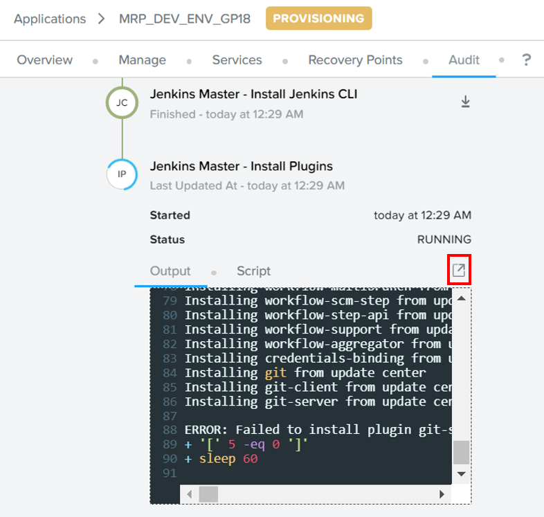

2.	The step may fail depending on the Jenkins version during installation.  Click on **Retry**.  Wait for the plugins to be installed.

    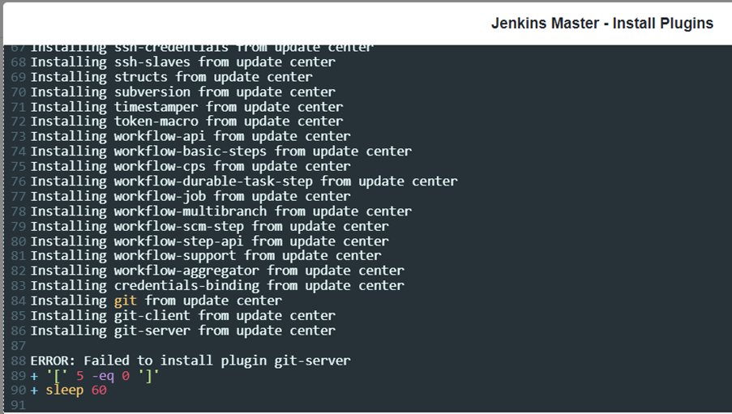

3.	Click on **Services**.  Click on **Jenkins Master**

    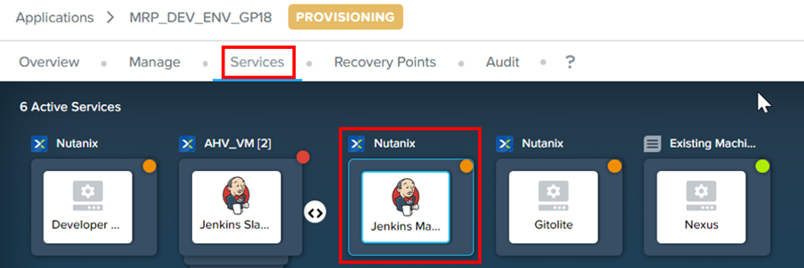

4.  Look on the right side of the screen.  Note down the IP address

    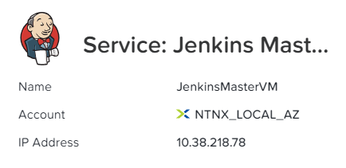

5.	Open a browser.

    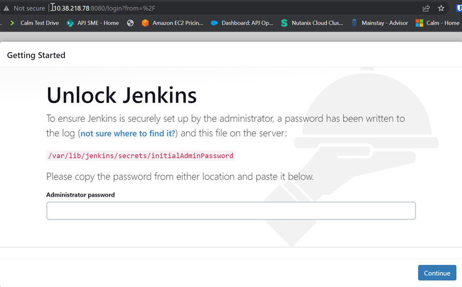

6.	In Calm application, click on **Audit**.  Scroll down.  Expand **Configure Jenkins Master**.   Copy the password and paste it in the Jenkins screen.

    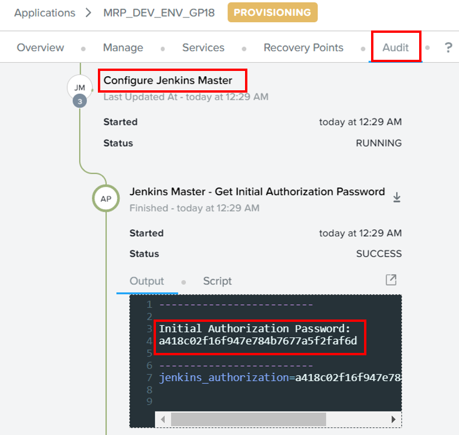

7.	Click on **Install suggested plugins**

    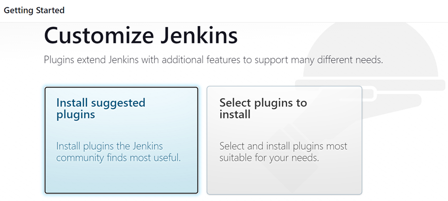

8.	Wait a few minutes for the plugins to install.

    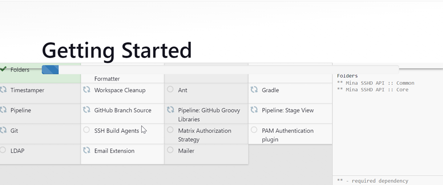

9.  Click on **Continue**

    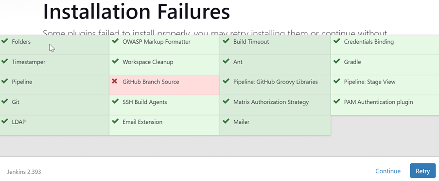

10.	Click on **Skip and continue as Admin**

    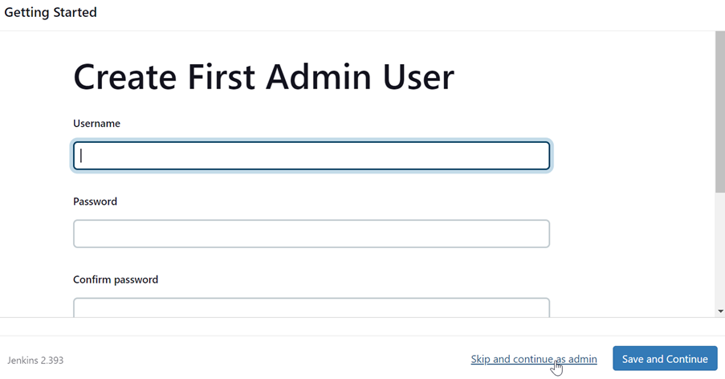

11.	Click on **Restart**

    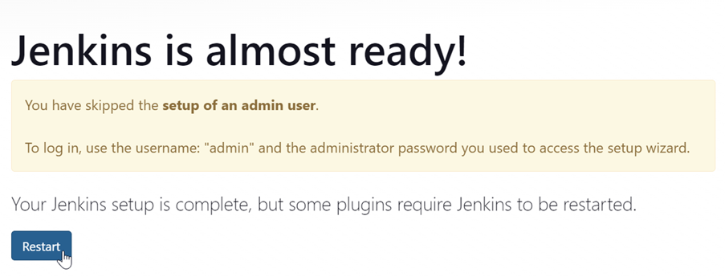

12.	In the Calm application, click on **Audit**.  Observe Calm has finished executing the **Jenkins Master – Install Plugins** step and continue with the rest of the provisioning

    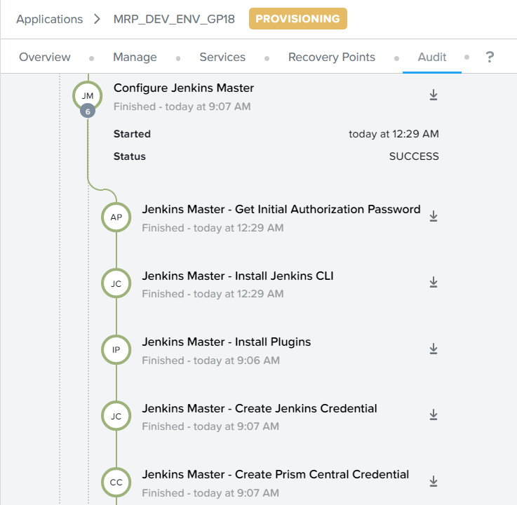

13.	The development environment was provisioned successfully.

    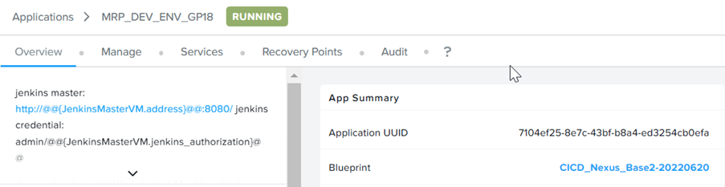

14.	Login to Jenkins using the initial administrator password.  Click on **Resume**

    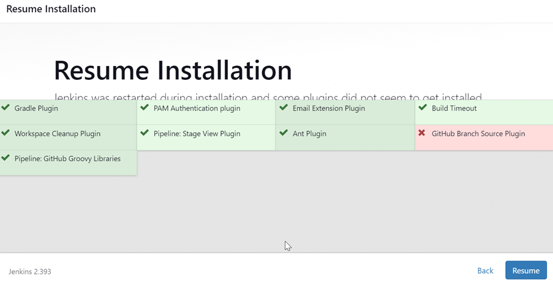

15.	Choose **Skip and continue as admin**

    

16.	 Choose **Start using Jenkins**

    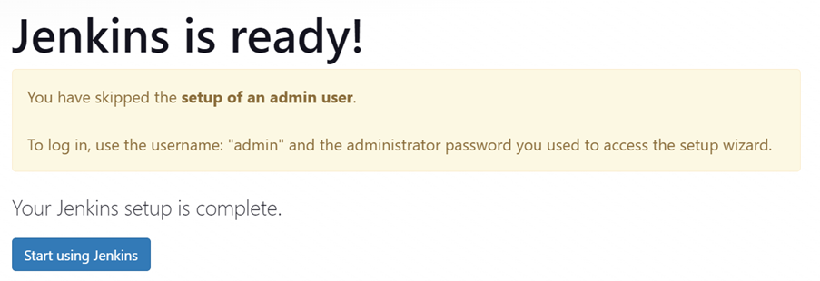

