import Tabs from '@theme/Tabs';
import TabItem from '@theme/TabItem';

# Continuous Integration & Continuous Delivery

The Continuous Integration/Continuous Delivery was setup using 2 different Calm blueprints:

1. Provision Development Environment

2.	Deploy application into NKE Kubernetes cluster

# Provision Development Environment

1.	The Development Environment comprises of the following:
a.	**Developer Workstation** – developer to develop their application
b.	**Gitolite** – version control source code
c.	**Jenkins Master** – CI tool
d.	**2 Jenkins slave** – execute build job

2.	Navigate to the Calm Blueprint.  Filter by **CICD**.  Click on **Launch**

    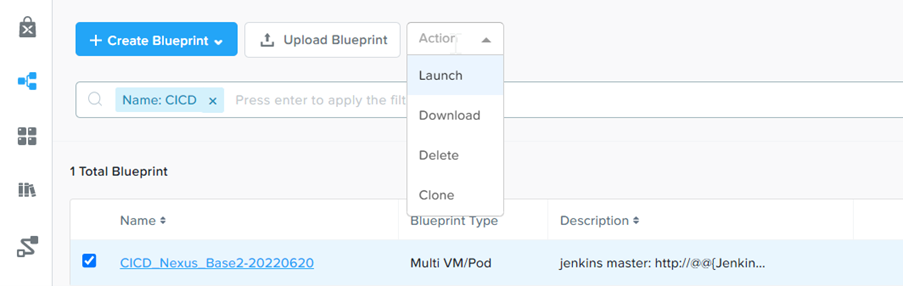

3.  Fill in the following:

    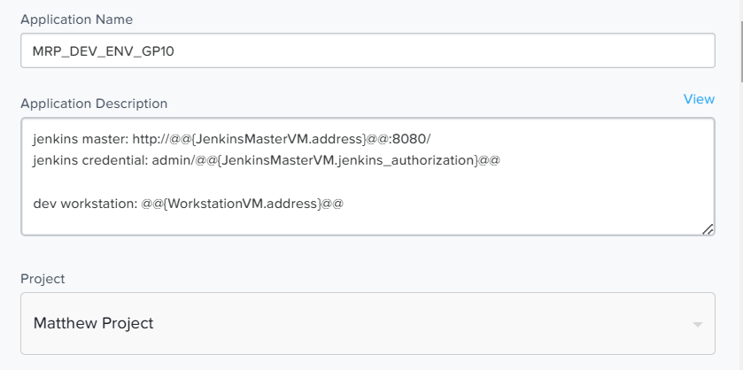

4.  Scroll down.  Fill in the Nexus Repository VM name

    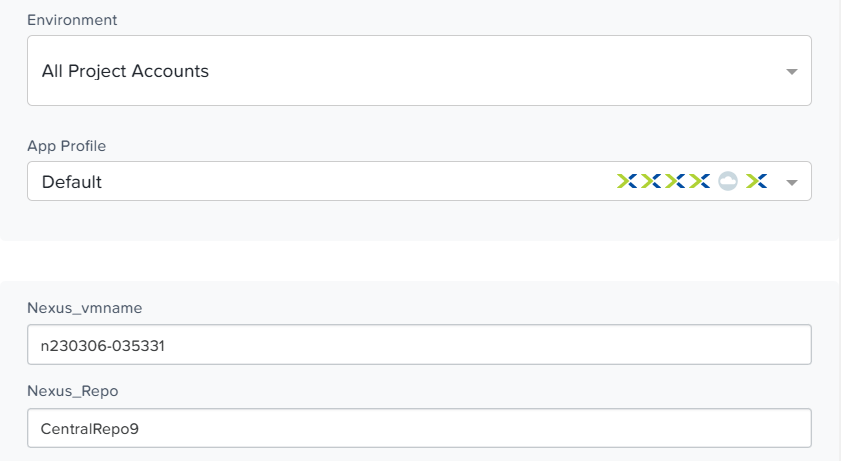

5.	Fill in the blueprint name for initial_app_deploy_blueprint according to your assigned cluster.  Eg

    **Application Deployment K8s Karbon Containers 171**

    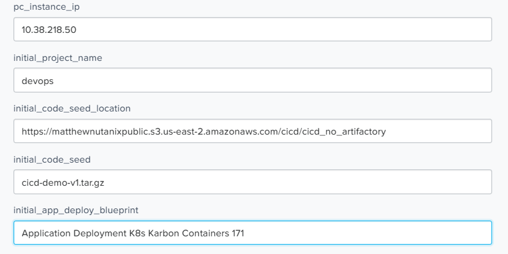

6.	Select the Nutanix cluster assigned by the trainer

    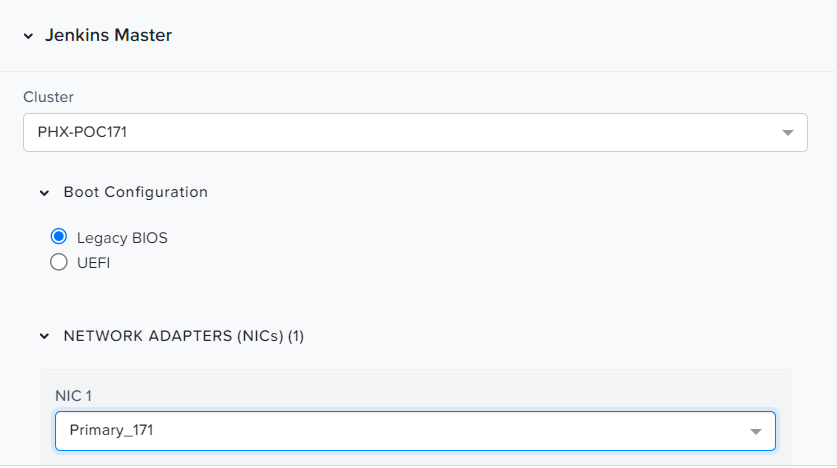

7.	Select the Nutanix cluster assigned by the trainer

    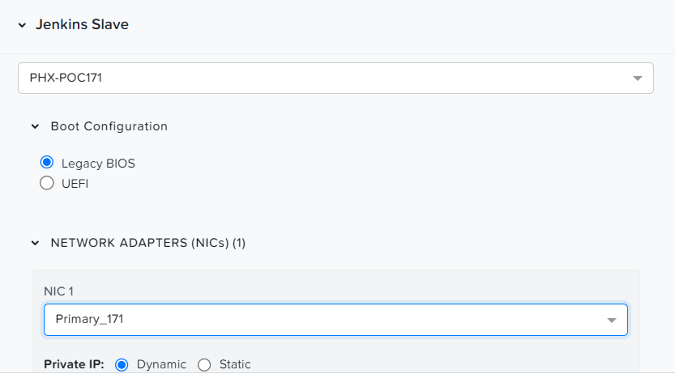

8.	Select the Nutanix cluster assigned by the trainer

    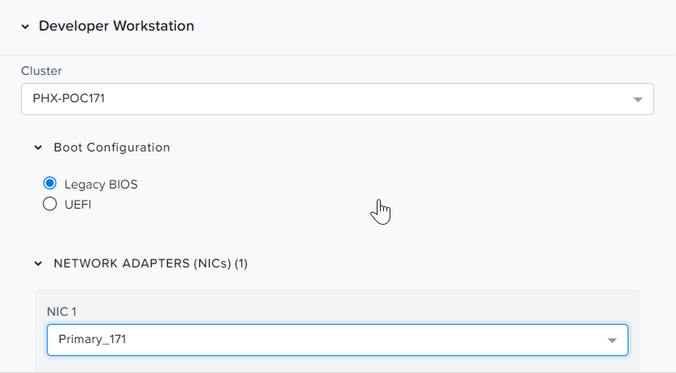

9.	Select the Nutanix cluster assigned by the trainer

    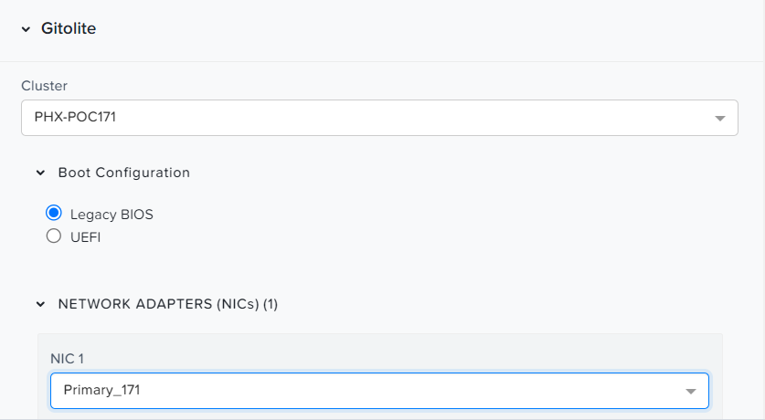

10.  Change the IP address of the Nexus VM as assigned by your trainer

    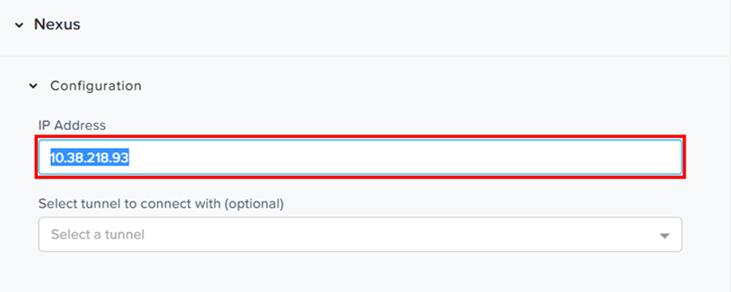

11.	Select the Nutanix cluster assigned by the trainer

    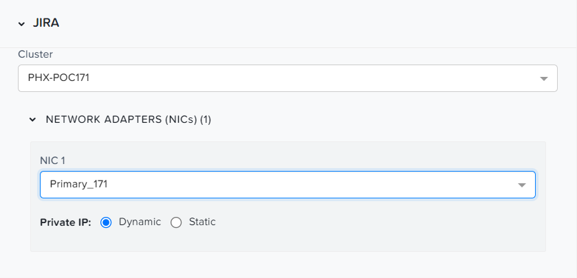

# Resolve Joining the AD Domain Failure

1.	Joining the AD domain may fail when multiple requests are initiated to the AD server on Ubuntu 20.04 disk image.  

2.  Click **Retry**.

    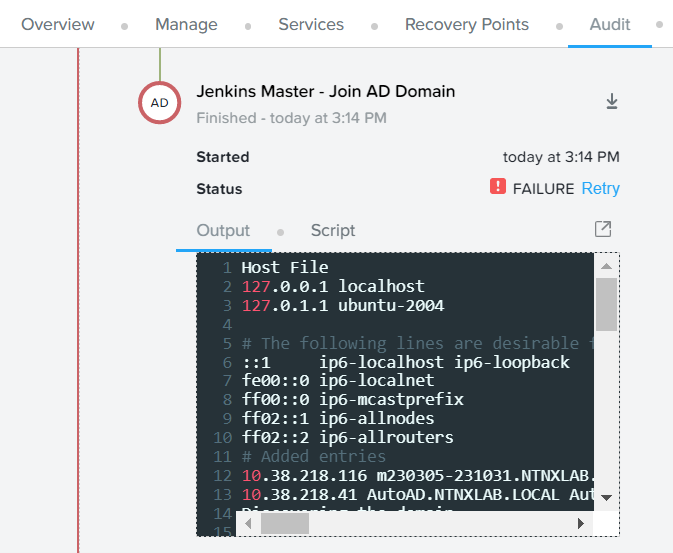

3.	Wait a few seconds and verify successful execution

    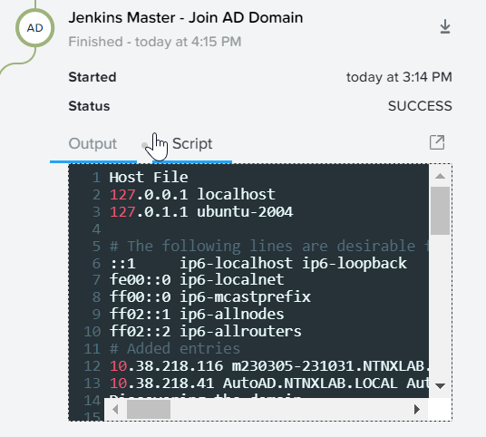

