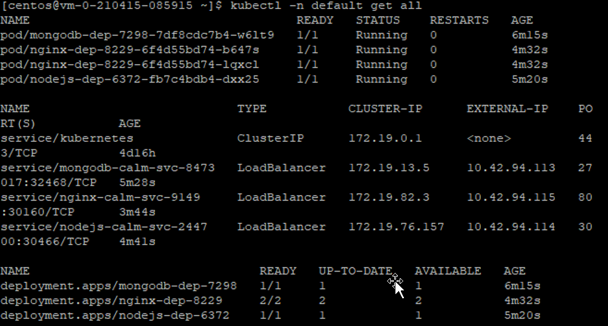
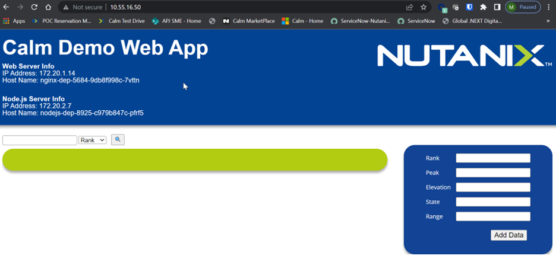

import Tabs from '@theme/Tabs';
import TabItem from '@theme/TabItem';

# Access the application

1.	Putty into a VM with kubectl installed.  Ensure the NKE KUBECONFIG was installed. Eg

    ```bash
    KUBECONFIG=/home/centos/cluster-name-kubectl.cfg
    export KUEBCONFIG.

2.	Run this command.  It was assumed the MetalLB was installed for the external IP address to show.

    ```bash
    kubectl -n default get all

3.  This is the output picture

     

4.  Open the browser and key in the external IP address for service/nginx-calm-svc-9149.

     


