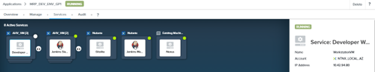
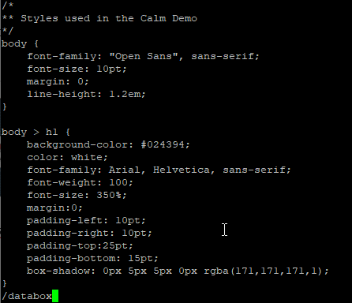
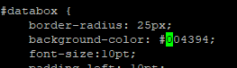
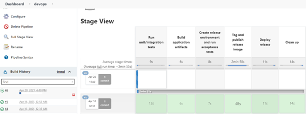
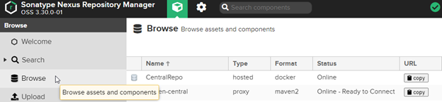
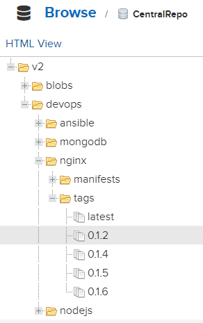

import Tabs from '@theme/Tabs';
import TabItem from '@theme/TabItem';

# Developer working on a change

1.	Find out the IP address for the Developer Workstation

    

2.	Putty into the IP address for the workstation.  

    ```bash
    username: nutanix
    password: retrieve the password from the trainer

3.	Run the following commands

    ```bash
    cd devops/web/src/css
    vi style.css

5.	Search for databox

    

6.	Change the background color.  Saved the change.

    

7.	Run the following command 

    ```bash
    cd ~/devops

8.	Run the following command to commit the change into the repository

    ```bash
    git add .
    git commit -m ‘change css’
    git push origin master

9.	Observe the Jenkins pipeline.  Drill into the devops pipeline.

     

10.	Wait for a few minutes for all the steps in the devops pipeline to complete.  

11.	Login to Nexus OSS repository.  Click on **Browse**.  Click on **CentralRepo**

     

12.	The latest version 0.1.6 corresponds to the Jenkins Build No 6.

     


  


