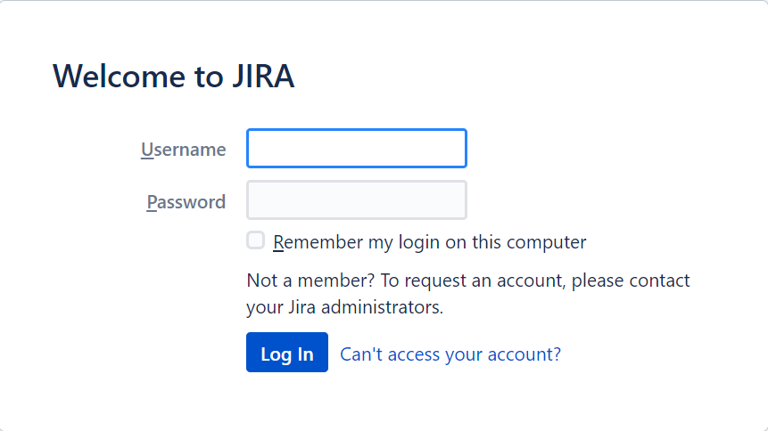
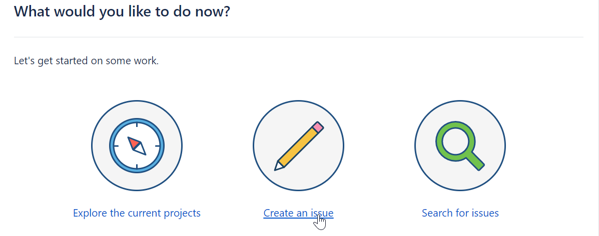
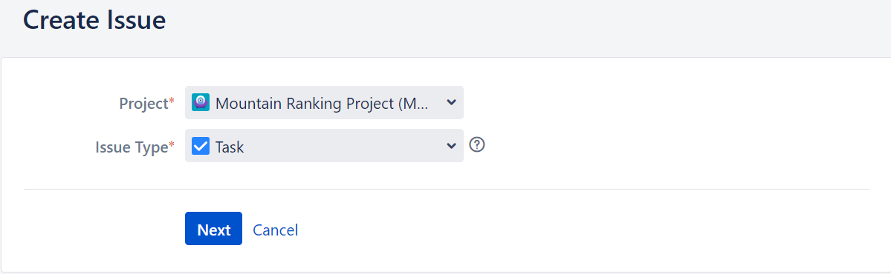
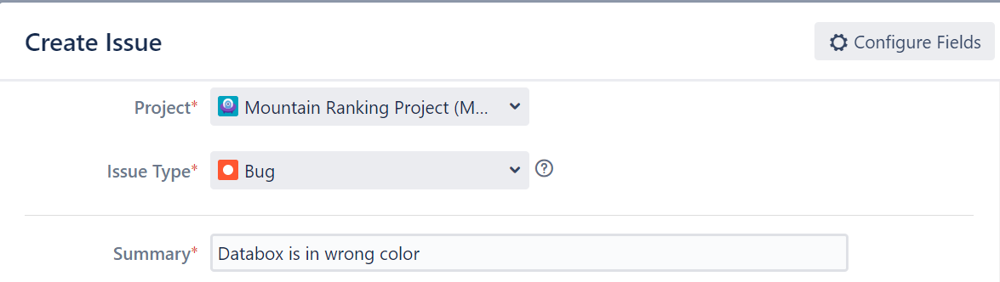
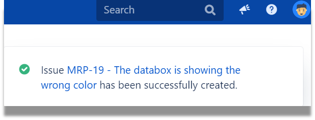
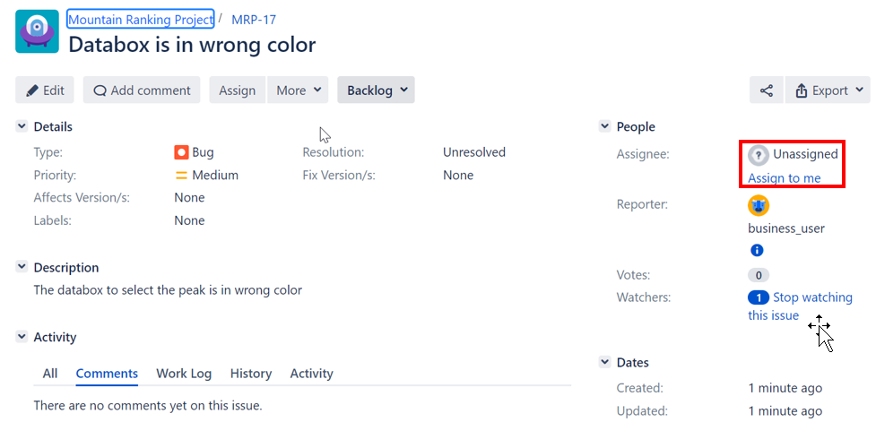

import Tabs from '@theme/Tabs';
import TabItem from '@theme/TabItem';

# Business User creates defect

1.  Click on your Chrome Browser or Internet Explorer.   The JIRA IP Address is available in the Excel spreadsheet.

    ```bash
    http://<JIRA IP Address>:8080. 

2.  Login using

    ```bash
    User Name: business_user
    Password: retrieve password from trainer

3.  This is the picture

     

4.  Click on **Create an issue**

     

5.  Select **Mountain Ranking Project**

     

6.  Select **bug**.  Fill in the details.  Click on **Create**

     

7.  This pop-up message will disappear in a few seconds.  Click on the link to look at the details of the created defect  

     

8.  The defect had not been assigned

     

