import Tabs from '@theme/Tabs';
import TabItem from '@theme/TabItem';

# Part 1 Environment Verification

# Calm Application Verification

1.	The application is in **Running** state

    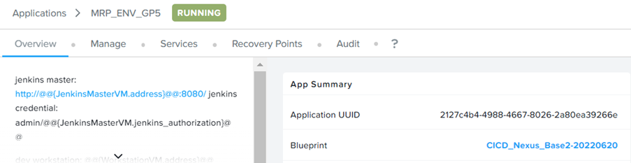

2.	Click on **Audit**.  Expand **Developer Workstation – Create**.  Expand **Setup Demo Project**.  Expand **Developer Workstation – Create and Push Docker Images**

    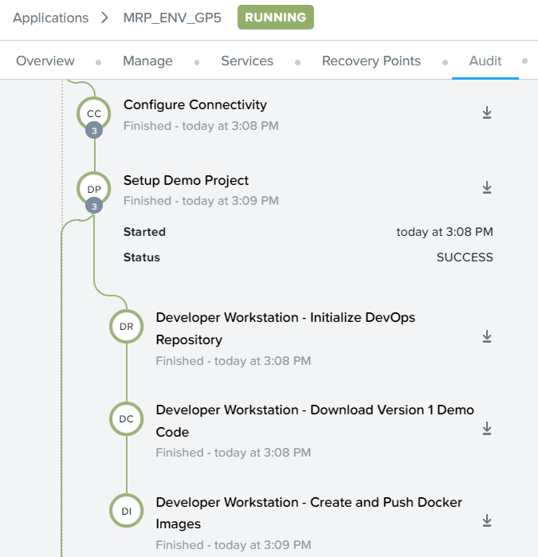

3.  Verify successful execution of build and push docker images to Nexus OSS repository

    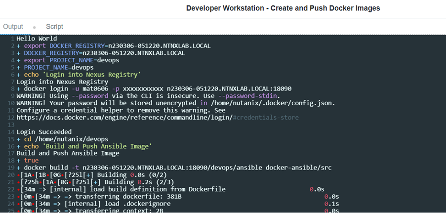

# Built Image in Nexus OSS Repository verification

1.	Login to Nexus OSS.

2.	Click on **Browse** icon.  Click on **Browse**.  Click on **Repository**

    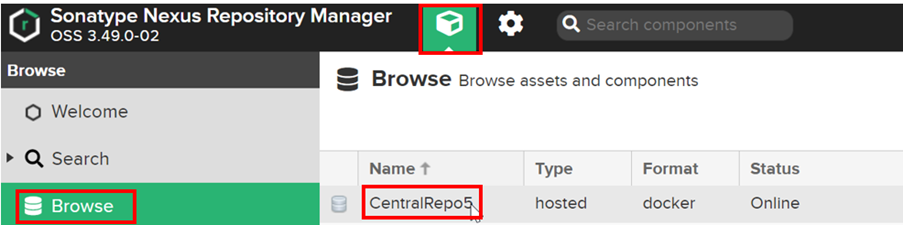

3.	Verify the image is stored in this repository

    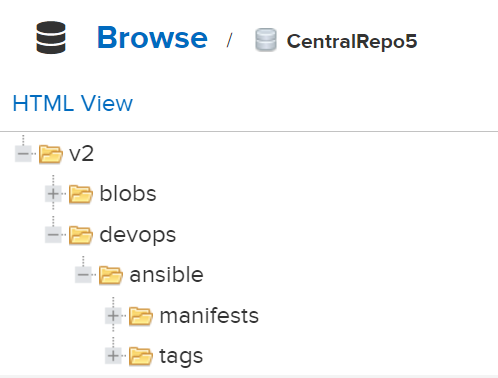

# Jenkins Verification

1.	If you choose to create the First admin user, it was important to use the Jenkins authorization password to create the admin user.  The consequence was “401 un-authorized” error when developer deliver the change to Git.

    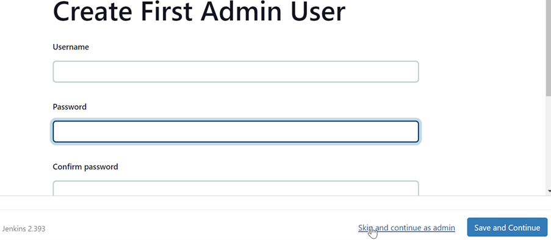

2.	Retrieve the Jenkins url in Calm Application.  Click on **Services**.  Click on **Jenkins Master**

    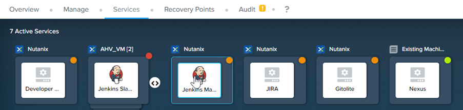

3.	On the right hand side of the screen, retrieve the **IP address**.

    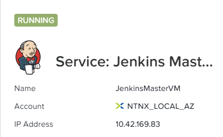

4.	Open the browser.  Put in the following url

    ```bash
    http://**<jenkins master>**:8080

5.	Login to Jenkins using 

    ```bash
    a.  Username: **admin**
    b.  Password: **Initial Administrator Authorization**

6.  This is an example

    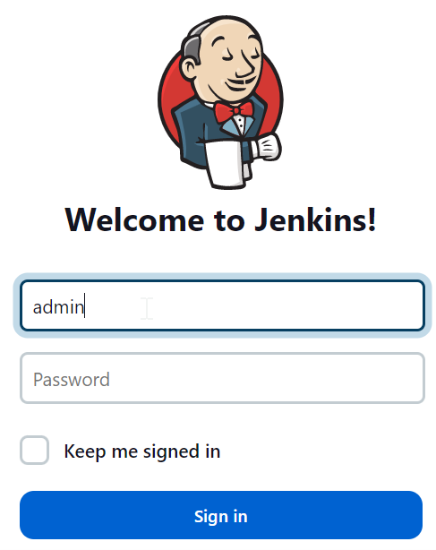

7.	Observe there are 2 pipelines created.  Drill into devops**<initial_project>** set in Calm blueprint

    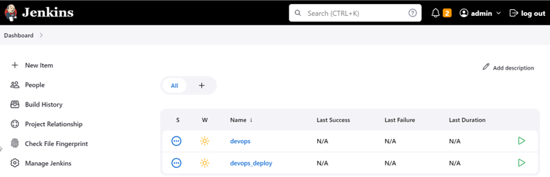

# Gitolite Repository configured

1.	Click on **Configure**.  Scroll down.  Observe the configuration to Gitolite repository

    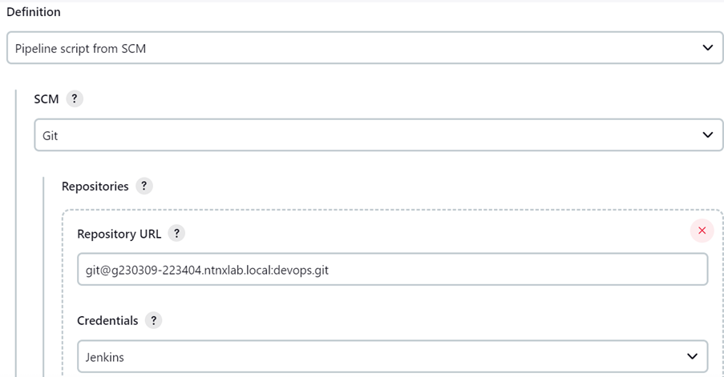

# Verify configuration to Nexus OSS

1.	Click on **Build with Parameters**

    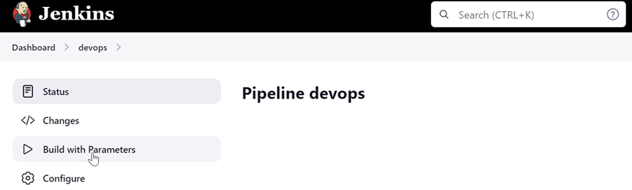

2.	Scroll down.  

    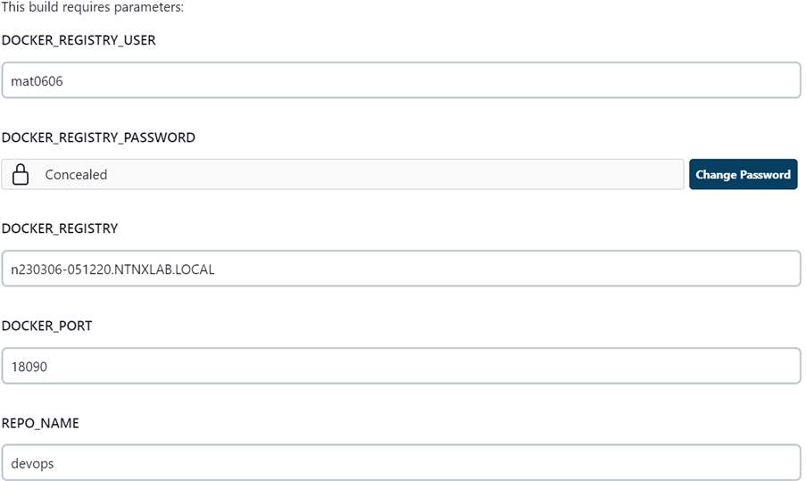

