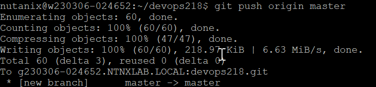

import Tabs from '@theme/Tabs';
import TabItem from '@theme/TabItem';

# Part 2 Build and Deployment Verification

# Verify Build & Deployment Process

1.	In Calm, navigate to **Application** icon.  Click on **Services**.  Click on **Developer**

    

2.	On the right side of the screen, note down the **IP address**

    

3.	Putty into the developer VM using the following credential:
    ```bash
    a.	Username: nutanix
    b.	Password: Check with the trainer

4.	Change the highlighted item.  Navigate to the directory.

    cd devops**<initial_project_name>** configured in the **CICD_Nexus_Base2-xxxx** blueprint

5.  Navigate to the directory based on the initial_project_name

    cd **devops218**

6.  An example is 

    ```bash
    cd devops initial_project_name configured in the CICD_Nexus_Base2-xxxx blueprint
    cd devops218

5.	Run these commands to add the files to the GIT local repository in the developer workstation

    

6.	Run this command to push the source codes to the Gitolite repository

    

# Verify Build Process in Jenkins

1.	In Calm, click on **Application** icon.  Click on **Services**.  Click on **Jenkins Master**

    

2.	On the right side of the screen, note down the IP address.

    

3.	Open a browser.  Put in the following url:

    ```bash
    http://**<jenkins master IP>**:8080

    

4.	Click on **Audit**.  Scroll down to **Developer Workstation**.  Expand and drill into **Developer Workstation – Jenkins Master Details**

    

5.	Login to Jenkins using admin user and initial authorization password.
