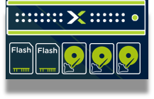

import Tabs from '@theme/Tabs';
import TabItem from '@theme/TabItem';

# Development Platform & Application Environments in Nutanix Hyper-Converged Infrastructure

When the customer flips his mobile phone to access the Internet Banking website, it is a mystery how the transactions are being performed.    This picture describes the view of the applications sitting on top of the infrastructure.  These are the explanation of the names described in this picture.

a)	Nutanix Node – Each Nutanix Node has its dedicated Central Processing Unit (CPU), Memory, SSD Drive and Hard Disk.  
    
 
b)	Nutanix Cluster – Each Nutanix Cluster is a combination of 2 to x no of Nutanix Nodes.  The physical infrastructure can size to scale to the most demanding work load.

c)	Acropolis Operating System (AOS) – Similar to your Windows 10 operating system, AOS is Nutanix OS providing data redundancy and reliability for all applications running on the Nutanix Node.  Each Nutanix Node is running on infrastructure like HPE, Lenovo, Dell & CISCO.

d)	Nutanix AHV Hypervisor – Similar to VMWare, AHV provides virtual machines virtualization across all operating systems.

e)	Nutanix Cloud Manager (NCM) Self Service – Enterprise Grade automation platform which focuses on 3 solutions areas:

1.	Infrastructure Automation 
2.	Operational Automation or Infrastructure Anywhere
3.	Application Automation

f)	Nutanix Kubernetes Engine (NKE) – Production Grade pure Kubernetes cluster as a service.  Kubernetes is the new modern infrastructure providing lower operating cost, auto-scaling of containers and fault-tolerant applications.

g)	PRISM Central – IT Operation Management Platform to view the overall capacity of the clusters, no of virtual machine, security policies.  PRISM Central can manage 1 or more Nutanix Clusters.  Most companies used scale out PRISM Central to manage multiple Nutanix Clusters or IT infrastructure within their company.  This lab deployed 3x scale out Prism Central to manage multiple Nutanix clusters.

