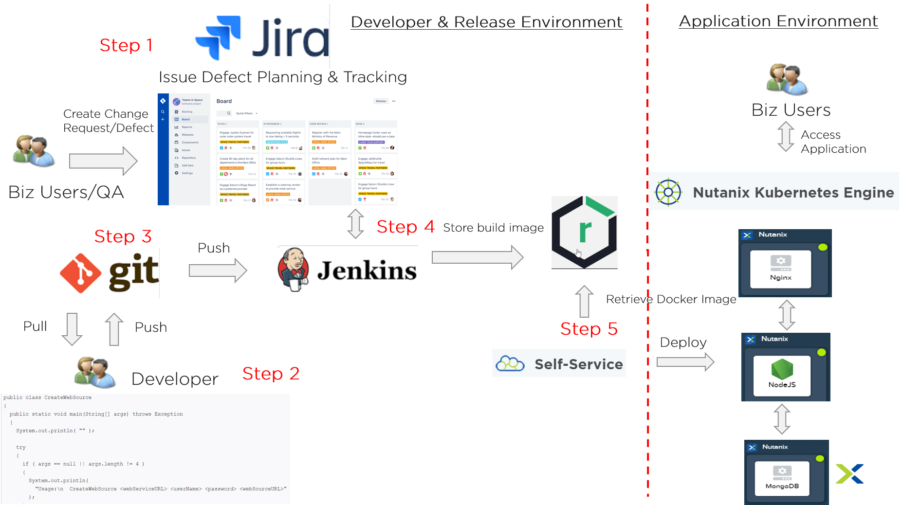
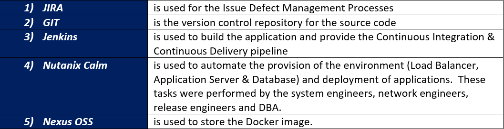

import Tabs from '@theme/Tabs';
import TabItem from '@theme/TabItem';

# Lab Overview

The user guide describes how the different stakeholders (Business User, Release Manager, Development Manager, Developer, Quality Assurance Engineer and Release Engineer) can collaborate together to plan, develop, test and deploy the applications to the production.

# Process Flow & Tools used in DevOps

