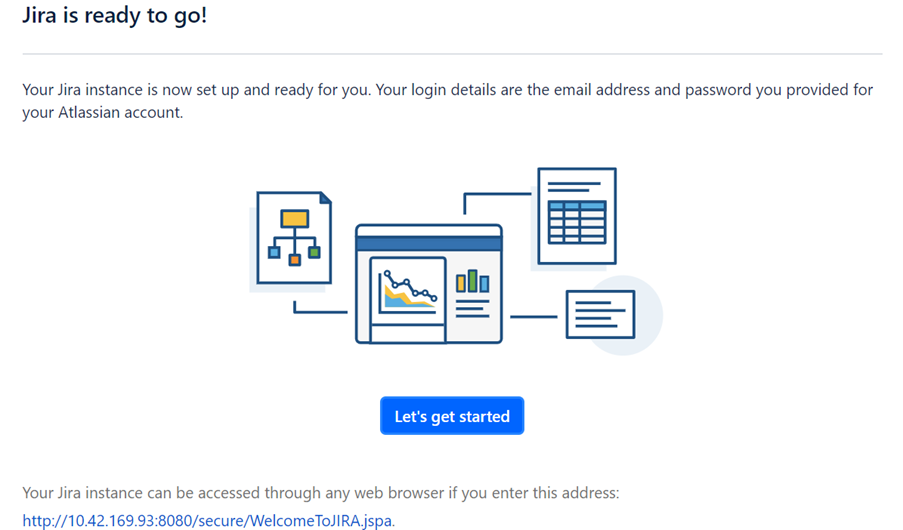

import Tabs from '@theme/Tabs';
import TabItem from '@theme/TabItem';

# Setup JIRA

1.	Navigate to **Application** on the left hand side.  Drill into the application.  Eg MRP_ENV_GP5  

    

2.	Click on **Services**.  Click on **JIRA**

    

3.  Note down the **IP address**.  Click on **Open Terminal**

    

4.	Run this command to navigate to the JIRA directory and shutdown JIRA

    ```bash
    cd /opt/atlassian/jira/bin
    sudo ./shutdown.sh

5.  This is the output of running the above command.

    

6.	Run this command to startup JIRA

    ```bash
    sudo ./startup.sh

7.  This is the output of running the above command

    

8.  Open a browser:  Put in the following url:

    ```bash
    http://JIRA IP address:8080

9.	Select **Set it up for me**.  Select **Continue to MyAtlassian**

    

10.	Select **Sign in to Atlassian with Google**

    

11.	Select the **Jira Software (Data Center)**

    

12.	Click on **Generate License**

    

13.	Select **Yes**

    

14.	Change to your email address.  Key in your own password.  Click on Next

    

15.  Wait a few mins for JIRA to power up

    

16.  The installation is ready.  Click on **Let’s get started**

    

17.  Click on **Continue**

    

18.	**Choose an avatar**.  Click on **Next**

    


