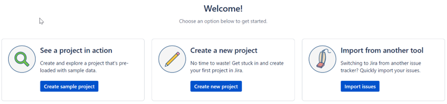
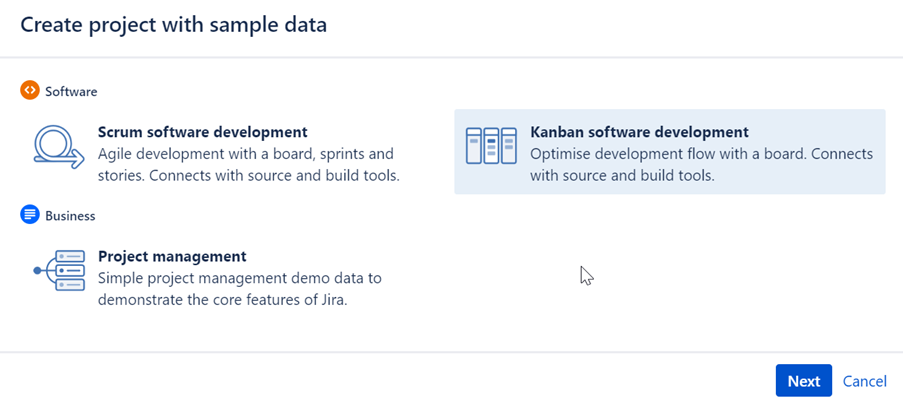
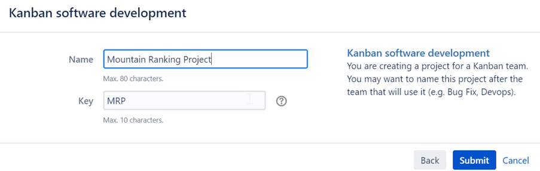
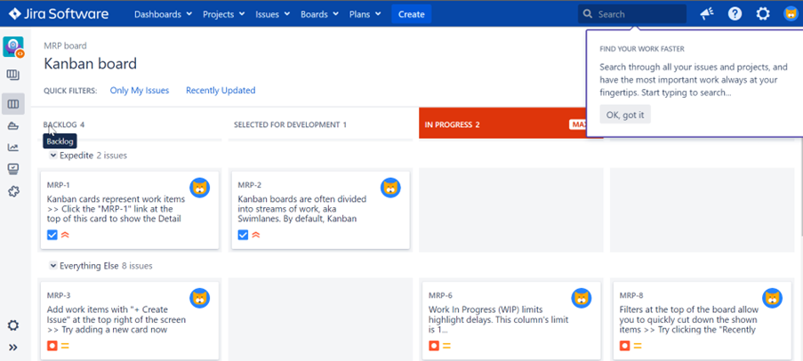

import Tabs from '@theme/Tabs';
import TabItem from '@theme/TabItem';

# Create Sample Project in JIRA

1.	Click on **Create sample project**

    

2.	Click on **Kanban software development**.  Click on **Next**

    

3.	Fill in the **project name**.  Click on **Submit**

    

4.	The sample project is created successfully

    

