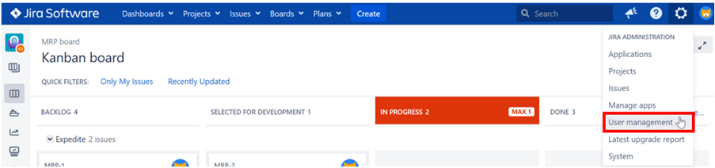
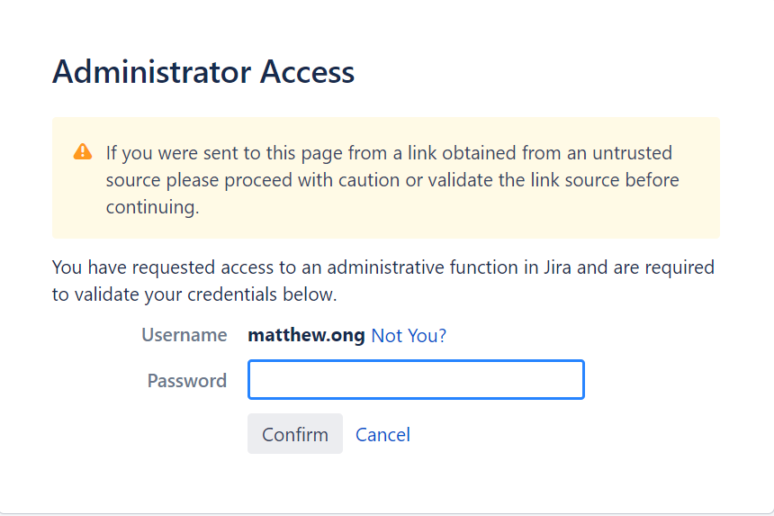
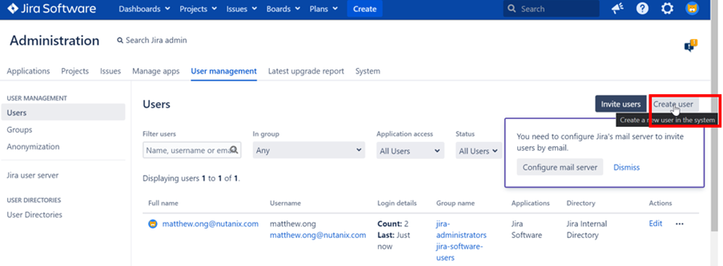
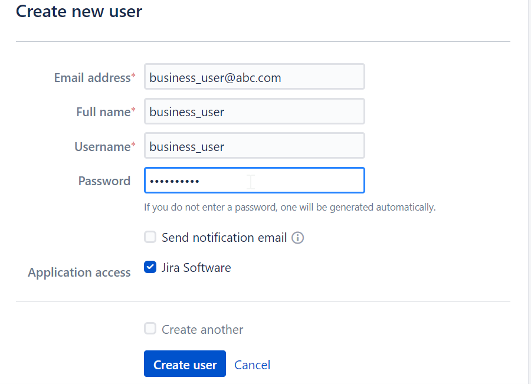

import Tabs from '@theme/Tabs';
import TabItem from '@theme/TabItem';

# Create users in JIRA

1.	Create 3 users: business_user, development_manager, developer.  

2.	Click on **User Management**

    

3.	Fill in the password set earlier

    

4.	Click on **Create User**

    

5.	Fill in the following.  Click on **Create User**

    

6.	Repeat for development manager & developer.
