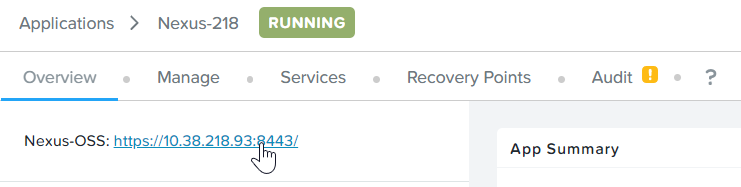

import Tabs from '@theme/Tabs';
import TabItem from '@theme/TabItem';

# Configure Nexus OSS Image Registry

Nexus OSS is an active product with on-going development from SonarType.  Nexus OSS may introduce new feature which require us to do further configuration to work with the CI/CD blueprint and NKE Kubernetes cluster.

# Login to Nexus OSS

1.  Click on **Application**.  Drill into the application provisioned.

    

2.	Click on **Audit**.  Scroll down.  Expand the **Nexus Create**->**Nexus Output Password**.  Copy the password.

    

3.  Copy the link.  Open a new browser and put the link in.

    

4.	Click on **Sign In**

    

5.  Key in **admin** and the password retrieved earlier.

    

6.  Click on Next.

    

7.	Key in the password assigned by the user.

    

8.	Choose **Enable anonymous access**

    

9.	Click on **Finish**

    

# Create an user for the build

1.	Click on **Administration** followed by **Users**.

    

2.	Click on **Create local user**.

    

3.	Fill in the following details.  
    a.	username: **mat0606**
    b.	email: **mat0606@hotmail.com**
    c.	Get the password from the trainer

     

4.  Scroll down.  Select the following role.  Click on **Create local user**

    

5.	Sign Out and login with **mat0606** user successfully

