import Tabs from '@theme/Tabs';
import TabItem from '@theme/TabItem';

# Part 2: Create Repository in Nexus

1.	Click on **Administration** icon and click on **Blob Stores**

    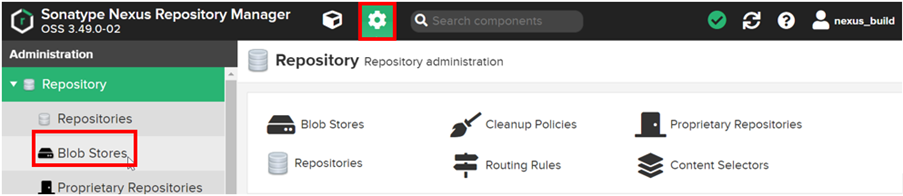

2.	Verify the storage available to store the built Docker images

    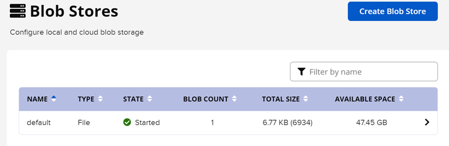

3.	Click on **Repositories**.  Click on **Create repository**

    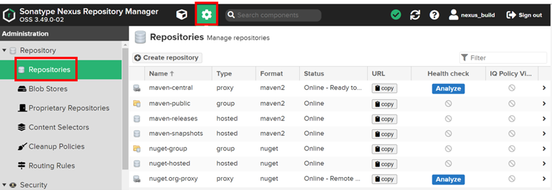

4.	Click on **docker (hosted)**.  Nexus OSS license is required for **docker (group)**

    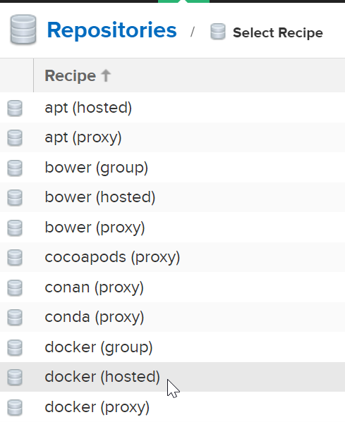

5.	Fill in the repository name.  **Remember to note down this repository name**.  It will be used when configuring the Nutanix Kubernetes Engine (NKE) and CI/CD blueprint.

    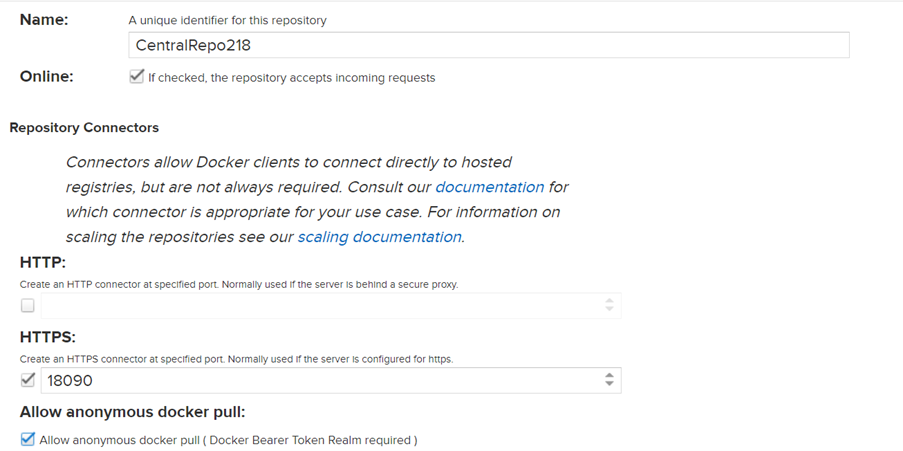

6.  Scroll down

    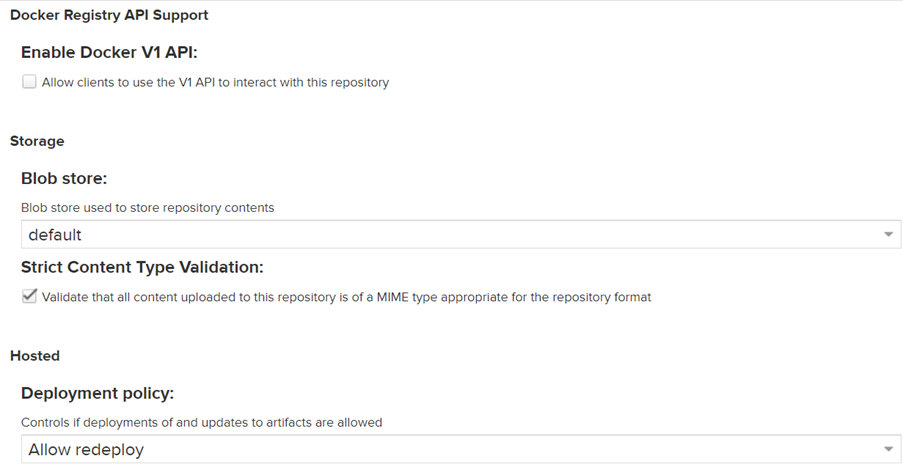

7.  Scroll down.  Click on **Create repository**

    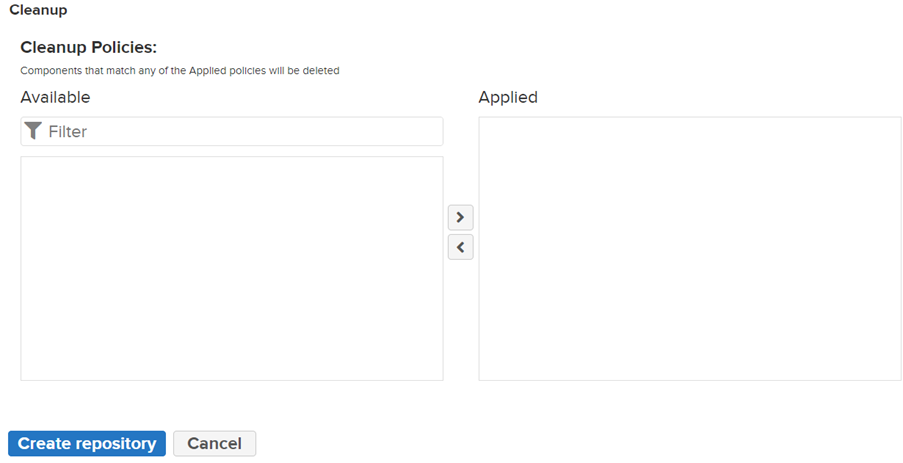

# Enable Docker Bearer Token

1.	This section is required to allow the use of docker login command and subsequently configuration integration with Nutanix Kubernetes Engine (NKE).

2.	Click on **Realms**

    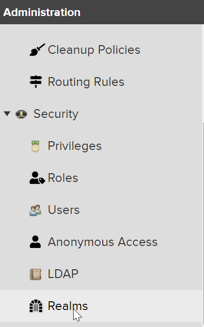

3.	Click on **Docker Bearer Token Realm**

    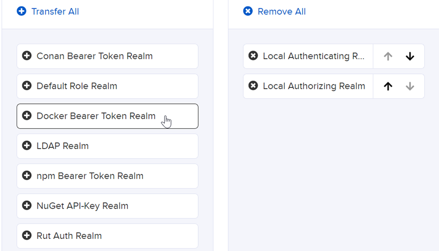

4.  Click on **Save**

5.	The active realms are

    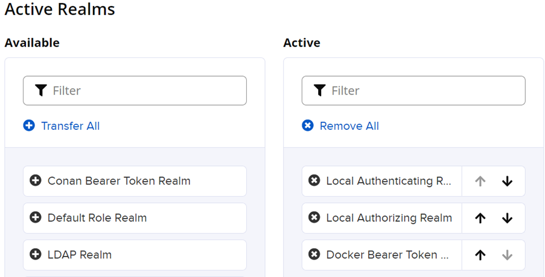

# Create password for centos user

1.	Click on Application icon.  Filter by nexus.  Drill into the assigned Nexus OSS.

    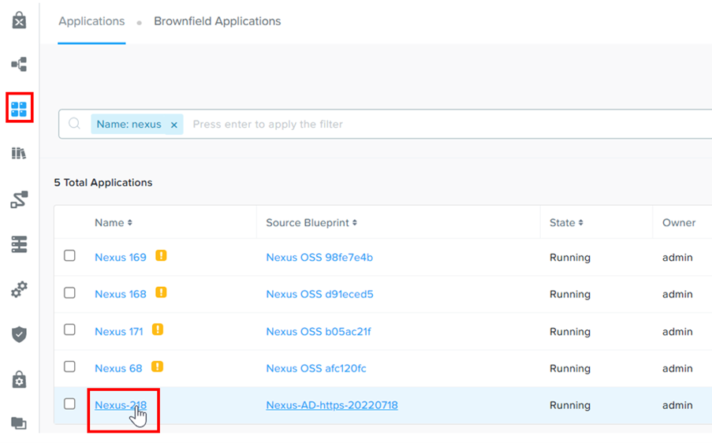

2.	Click on **Services**.  Click on **Nexus**

    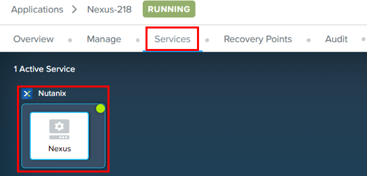

3.	On the right side of the screen, click on **Open Terminal**

4.  Run this command.  Change the password to **nutanix/4u**

