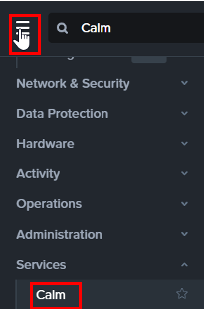
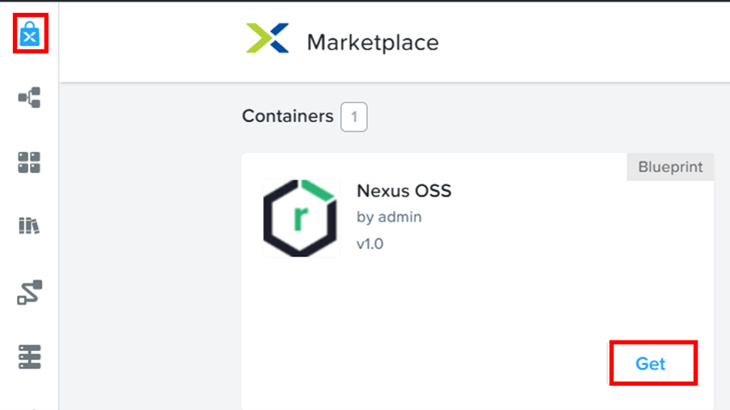
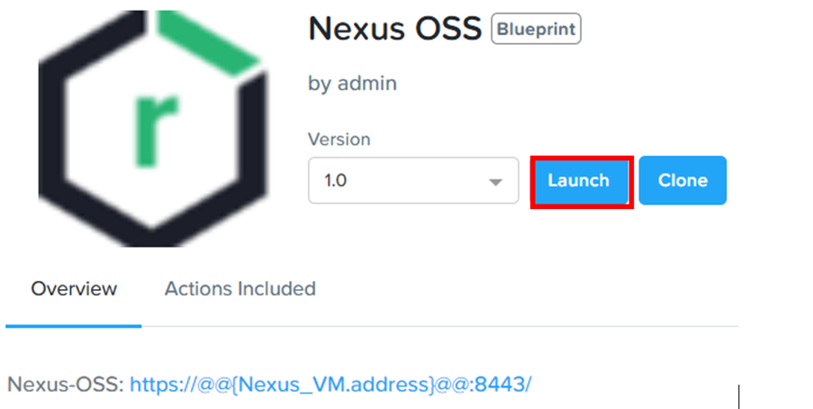
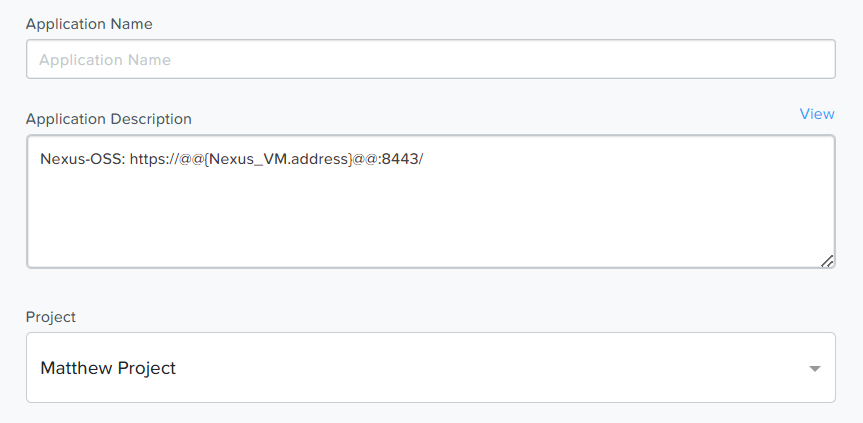
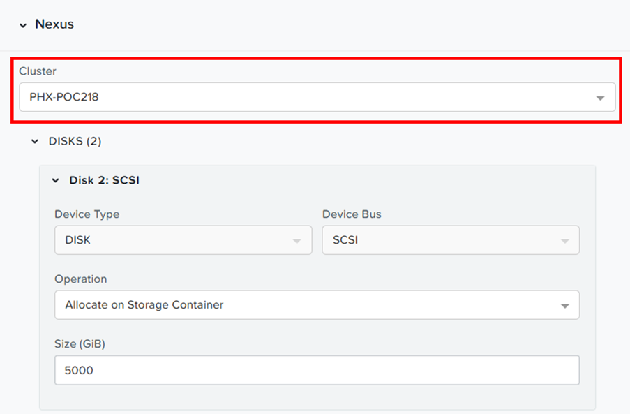

import Tabs from '@theme/Tabs';
import TabItem from '@theme/TabItem';

# Provision Nexus OSS Image Registry

1.	Click on the highlighted to access Calm

    

2.	Click on highlighted to access Calm Marketplace.  Click on **Get** to provision Nexus OSS

    

3.	Click on **Launch**

    

4.	Fill in the **application name**

    

5.	Scroll down.  Select the cluster as indicated by the trainer.

    

    

