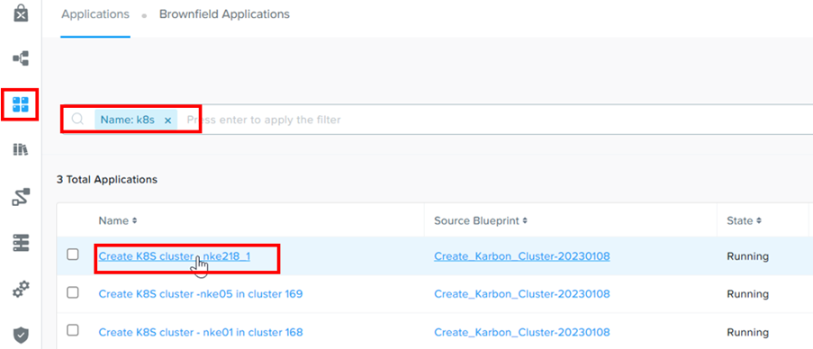
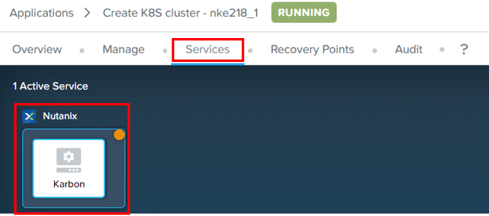
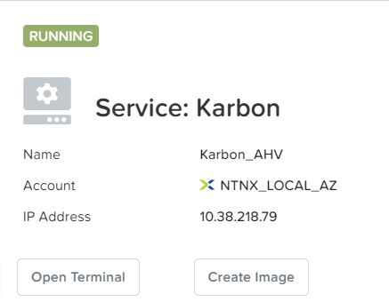
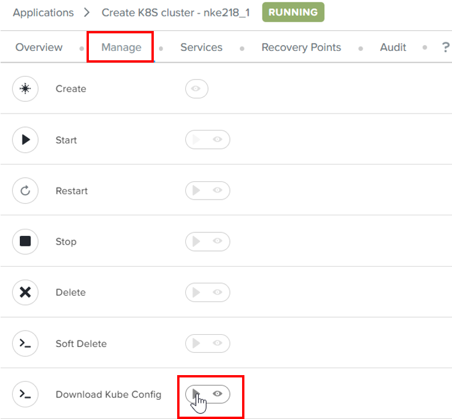
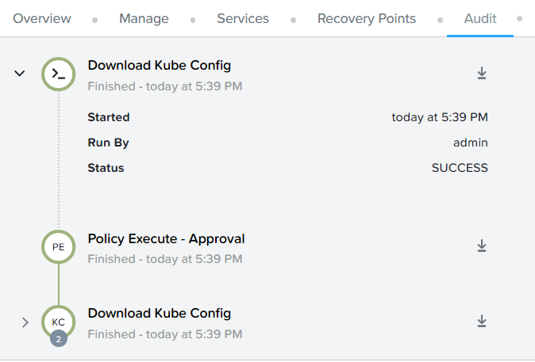
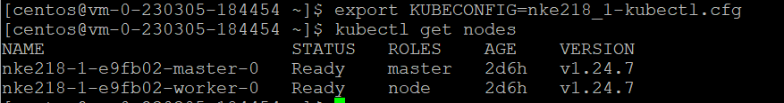
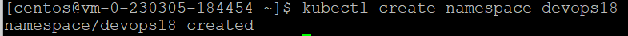

import Tabs from '@theme/Tabs';
import TabItem from '@theme/TabItem';

# What is namespace

In Kubernetes, namespaces provides a mechanism for isolating groups of resources within a single cluster. Names of resources need to be unique within a namespace, but not across namespaces. Namespace-based scoping is applicable only for namespaced objects (e.g. Deployments, Services, etc) and not for cluster-wide objects (e.g. StorageClass, Nodes, PersistentVolumes, etc)

https://kubernetes.io/docs/concepts/overview/working-with-objects/namespaces/

# Retrieve IP address of the Centos VM

1.	Navigate to application.  Filter by **k8s**.  Drill into the application

    

2.	Select **Services**.  Select **Karbon**.

    

3.	Retrieve the IP address

    

# What is kubeconfig

The kubeconfig is a configuration file for running kubectl commands against the deployed Kubernetes cluster. 

# Refresh the NKE authorization token

The kubeconfig token expires after 24 hours

https://portal.nutanix.com/page/documents/details?targetId=Nutanix-Kubernetes-Engine-v2_7:top-download-kubeconfig-t.html

1.	Click on **Manage**.  Click on **Download Kube Config**

    

2.	Click on **Audit**.  Observe successful execution.

    

# Create the namespace in the Kubernetes cluster

1.	Putty into the Centos VM

2.	Run these commands to ensure the connection to the NKE cluster

    ```bash
    export KUBECONFIG=<cluster_name>-kubectl.cfg
    kubectl get nodes

    

3.	Create the namespace as assigned by your trainer.

    ```bash
    kubectl create namespace devops<as assigned by your trainer>

    


