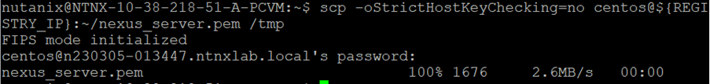
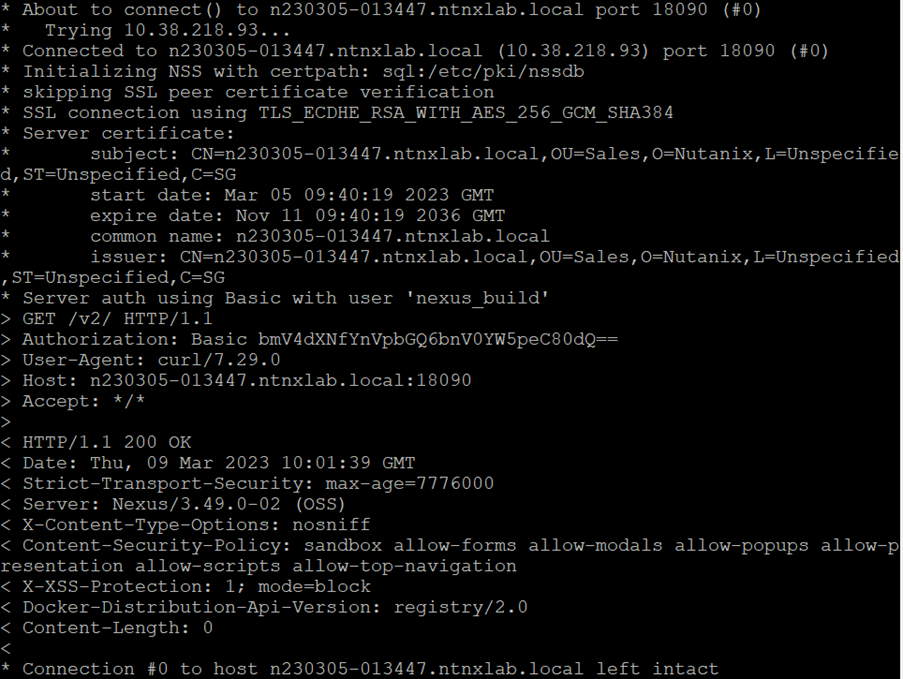
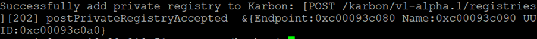
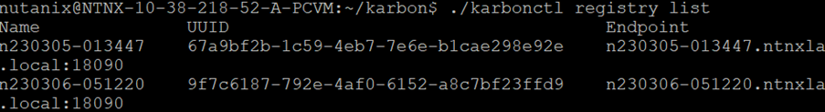
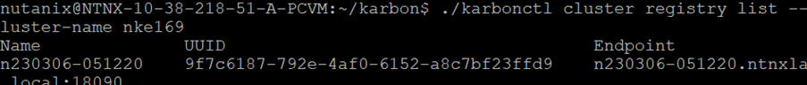

import Tabs from '@theme/Tabs';
import TabItem from '@theme/TabItem';

# Register Nexus OSS with NKE cluster

NKE had defined the following requirements for the image registry such as JFrog Artifactory or Nexus OSS.

1.  The image registry must be configured to use HTTPS.
2.  The certificate generation for the private image registry must contains Subject Alternate Name

The Nexus OSS HTTPS blueprint would provision a Nexus OSS Repository which meet these requirements

# Retrieve the VM name for Nexus Image Registry

1.	Click on Application icon.  Filter by Nexus.  Drill into your assigned image registry

    

2.	Click on **Services**.  Click on **Nexus**

    

3.	On the right side of the screen, note down the VM name for Nexus server.

    

# Create Secret to register Docker server and credential

1.	Change the window to the putty tab for Centos VM in the “Create K8S cluster” Calm application.

2.	Change this command according to your assigned Nexus VM and Kubernetes namespace

    ```bash
    a.  docker-server
    b.  namespace

3.  This is an example of the command
    ```bash
    kubectl create secret docker-registry regcred --docker-server=https://n230305-013447.ntnxlab.local:18090 --docker-username=mat0606 --docker-password=xxxxx --docker-email=mat0606@hotmail.com -n devops18

# Setup Nexus Name Resolution in Prism Central

NKE needs to trust the Nexus OSS certificate

1.	Putty into Prism Central using the credential provided by the trainer.

2.	Change the highlighted according to your environment.

    **10.38.218.93 n230305-013447.ntnxlab.local n230305-013447**

    ```bash
    sudo vi /etc/hosts
    "10.38.218.93 n230305-013447.ntnxlab.local n230305-013447" 

3.  This is a picture for this command

     

4.	Repeat for Prism Central Scale Out.  Request the 3 Prism Central IP address from the trainer.

# Transfer Nexus OSS certificate into Prism Central

1.	Putty into Prism Central

2.	Change the highlighted item.  Run this command to transfer the nexus_server.pem in Nexus OSS VM into Prism Central tmp directory.

    REGISTRY_IP=**n230305-013447.ntnxlab.local**
    
    ```bash
    REGISTRY_IP=n230305-013447.ntnxlab.local
    scp -oStrictHostKeyChecking=no centos@${REGISTRY_IP}:~/nexus_server.pem /tmp

3.	Key in the password as advised by the trainer

    

4.	Run this command

    ```bash
    sudo mv /tmp/nexus_server.pem /etc/ssl/certs
    cd /etc/ssl/certs

5.	Change the highlighted based on which cluster the Nexus is deployed.  Check with the trainer

    ```bash
    sudo mv nexus_server.pem nexus_server_218.crt

6.	Repeat for Prism Central Scale Out.  

# Register Nexus OSS Private Image Registry with NKE

1.	Putty into the Prism Central.  Login to Karbonctl using Prism Central UI password

2.	Navigate to this directory

    ```bash
    cd /home/nutanix/karbon

3.	Retrieve the prism central web password from the trainer.  Run this command.

    ```bash
    ./karbonctl login --pc-username admin --pc-password xxxxxx

4.	Change the highlighted item

    curl -k -v -X GET -u **nexus user id**:**nexus password** **https://n230305-013447.ntnxlab.local:18090/v2/** --cacert /etc/ssl/certs/nexus_server**_218**.crt

5.  An example is 

    ```bash
    curl -k -v -X GET -u <nexus user id>:<nexus password> https://n230305-013447.ntnxlab.local:18090/v2/ --cacert /etc/ssl/certs/nexus_server_218.crt


6.	Run this command to test the connection to the Nexus OSS.

    

7.	Register the Nexus OSS private registry with Karbon Private Image Registry.  Change the highlighted item.

    ```bash
    ./karbonctl registry add --name **n230305-013447** --url **n230305-013447**.ntnxlab.local --port **18090** --cert-file **/etc/ssl/certs/nexus_server_218.crt** --username **nexus username** --password **nexus password**
    
8. This is an example for the command

    ```bash
    ./karbonctl registry add --name n230305-013447 --url n230305-013447.ntnxlab.local --port 18090 --cert-file /etc/ssl/certs/nexus_server_218.crt --username nexus username --password nexus password

9.	The output is

    

10.  Verify the output

    

11.	Change the highlighted items as assigned by your trainer.  The Nexus OSS registry name is based on what you have provisioned earlier.  Register the Nexus OSS private registry with NKE Kubernetes Cluster

    ./karbonctl cluster registry add --cluster-name **nke218_1** --registry-name **n230305-013447**

12. An example is

    ```bash
    ./karbonctl cluster registry add --cluster-name nke218_1 --registry-name n230305-013447

13.  Change the highlighted item.  Run the command to verify the registry

    ./karbonctl cluster registry list --cluster-name **nke218_1**

14.  An example is 

    ```bash
    ./karbonctl cluster registry list --cluster-name nke218_1

15.  This is an example of the output

     


