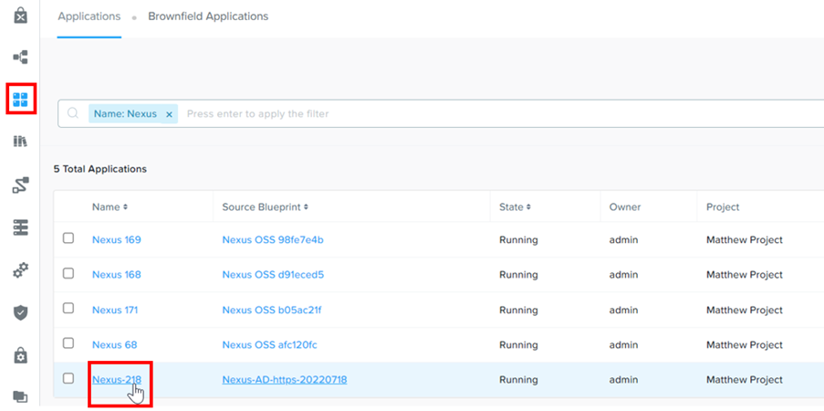
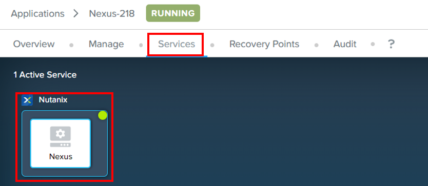
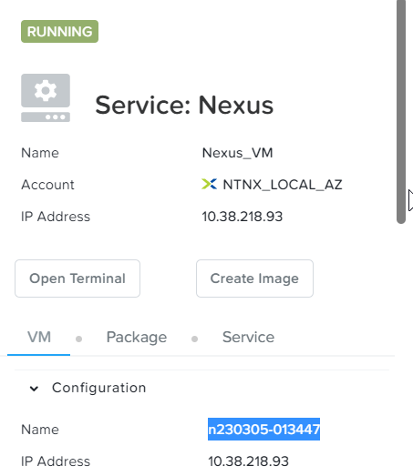
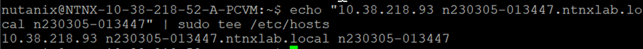

import Tabs from '@theme/Tabs';
import TabItem from '@theme/TabItem';

# Part 1: Register Nexus OSS with NKE cluster

NKE had defined the following requirements for the image registry such as JFrog Artifactory or Nexus OSS.

•	The image registry must be configured to use HTTPS.
•	The certificate generation for the private image registry must contains Subject Alternate Name

The Nexus OSS HTTPS blueprint would provision a Nexus OSS Repository which meet these requirements

# Retrieve the VM name for Nexus Image Registry

1.	Click on Application icon.  Filter by Nexus.  Drill into your assigned image registry

    

2.	Click on **Services**.  Click on **Nexus**

    

3.	On the right side of the screen, note down the VM name for Nexus server.

    

# Create Secret to register Docker server and credential

1.	Change the window to the putty tab for Centos VM in the “Create K8S cluster” Calm application.

2.	Change this command according to your assigned Nexus VM and Kubernetes namespace

    a.  docker-server
    b.  namespace

    ```bash
    kubectl create secret docker-registry regcred --docker-server=https://n230305-013447.ntnxlab.local:18090 --docker-username=mat0606 --docker-password=xxxxx --docker-email=mat0606@hotmail.com -n devops18

# Setup Nexus Name Resolution in Prism Central

NKE needs to trust the Nexus OSS certificate

1.	Putty into Prism Central using the credential provided by the trainer.

2.	Change the highlighted according to your environment.

    **10.38.218.93 n230305-013447.ntnxlab.local n230305-013447**

    ```bash
    sudo vi /etc/hosts
    "10.38.218.93 n230305-013447.ntnxlab.local n230305-013447" 

     

3.	Repeat for Prism Central Scale Out.  Request the 3 Prism Central IP address from the trainer.


