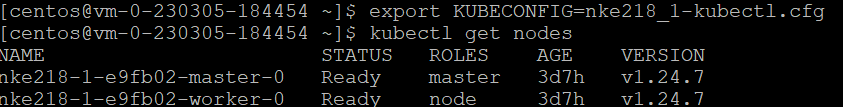
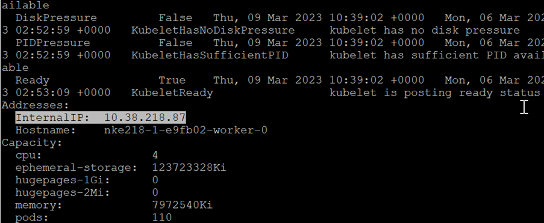
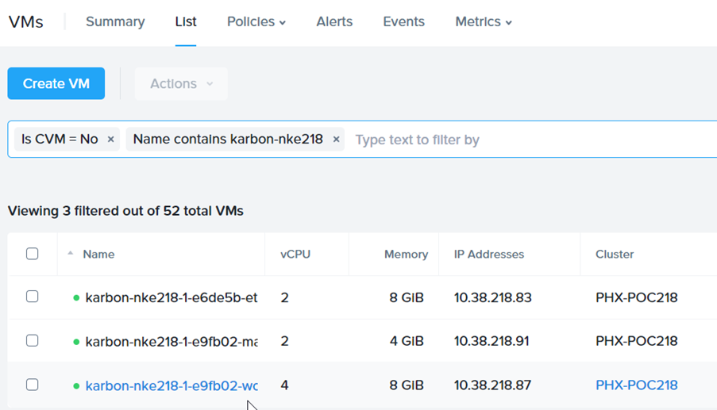
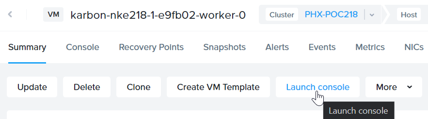
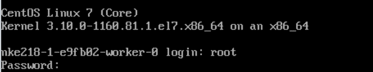
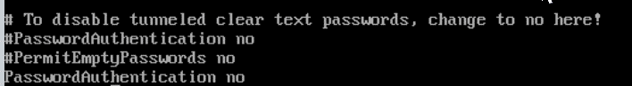
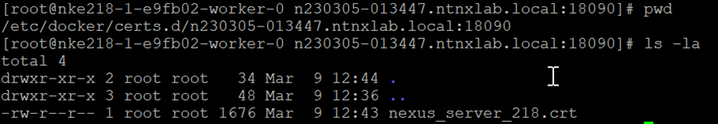
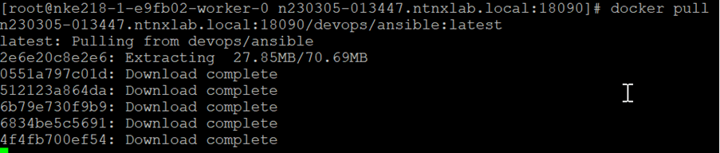

import Tabs from '@theme/Tabs';
import TabItem from '@theme/TabItem';

# Configure Worker Node in NKE cluster

# Find out IP address of worker node

1.	Login to centos VM.  Connect to the NKE cluster

    

2.	Run this command to find out the IP address for the worker node

    ```bash
    kubectl describe node <node name>

3.	Scroll down and observe the internal IP.

    

# Change worker node ssh configuration

1.	Login to Prism Central web.  Navigate to VM.

2.	Filter by **karbon** and **cluster name** as shown in the picture below.  Drill into the worker node based on the IP address retrieved earlier

    

3.	Click on **Launch Console**

    

4.	Login using root.  Retrieve the password from the trainer.

    

5.	Run this command 

    ```bash
    vi /etc/ssh/sshd_config.  
    
6.  Change PasswordAuthentication from **no** to **yes**

    

7.	Run these commands to restart the ssh service

    ```bash
    systemctl stop sshd
    systemctl start sshd

# Configure worker node to trust the Nexus OSS certificate

1.	Putty into the worker node using root user.

2.	Run this command to install sshpass in the worker node

    ```bash
    sudo yum install -y sshpass

3.	Change the highlighted item.  Run these commands

    sudo mkdir **n230305-013447.ntnxlab.local:18090**

    ```bash
    sudo mkdir /etc/docker/certs.d
    cd /etc/docker/certs.d
    sudo mkdir n230305-013447.ntnxlab.local:18090

4.	Change the highlighted item.  Run these commands to copy the Nexus OSS certificate into the worker node

    sshpass -p **nexus password** scp -oStrictHostKeyChecking=no centos@**n230305-013447.ntnxlab.local**:/home/centos/nexus_server.pem /tmp

5.  In the NKE worker node, move the file to the specified directory

    mv /tmp/nexus_server.pem /etc/docker/certs.d/**n230305-013447.ntnxlab.local:18090**/nexus_server.pem

6.  In the NKE worker node, change the filename from nexus_server.pem to nexus_server_xxx.crt

    cd **n230305-013447.ntnxlab.local:18090**
    mv nexus_server.pem nexus_server_**218**.crt
    
7.  This is a consolidated example from step 4 to 6

    ```bash
    sshpass -p nexus password scp -oStrictHostKeyChecking=no centos@n230305-013447.ntnxlab.local:/home/centos/nexus_server.pem /tmp
    mv /tmp/nexus_server.pem /etc/docker/certs.d/n230305-013447.ntnxlab.local:18090/nexus_server.pem
    cd n230305-013447.ntnxlab.local:18090
    mv nexus_server.pem nexus_server_218.crt

5.	Verify the certificate is in this directory

    

6.	Run these commands to effect the change

    ```bash
    update-ca-trust
    systemctl restart docker.service

# Verification to pull images in the worker node

1.	Change the highlighted item.  Run this command.

    docker login -u **nexus username** -p **nexus password** **n230305-013447.ntnxlab.local:18090**

    ```bash
    docker login -u nexus username -p nexus password n230305-013447.ntnxlab.local:18090

2.	Change the highlighted item.  Run this command to test the pulling of image from the Nexus OSS registry

    docker pull **n230305-013447.ntnxlab.local:18090**/devops/ansible:latest

    ```bash
    docker pull n230305-013447.ntnxlab.local:18090/devops/ansible:latest

3.  This is the picture

    

4.  Repeat the step for each worker node.  The lab has 1 worker node only.


