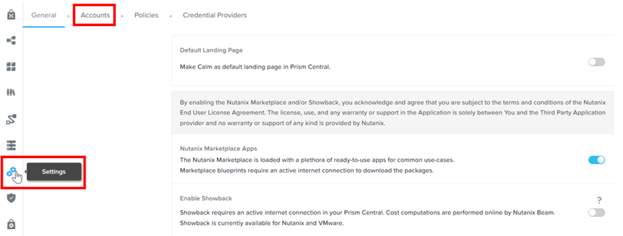
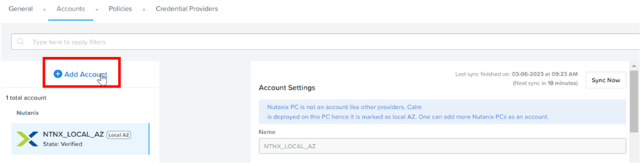
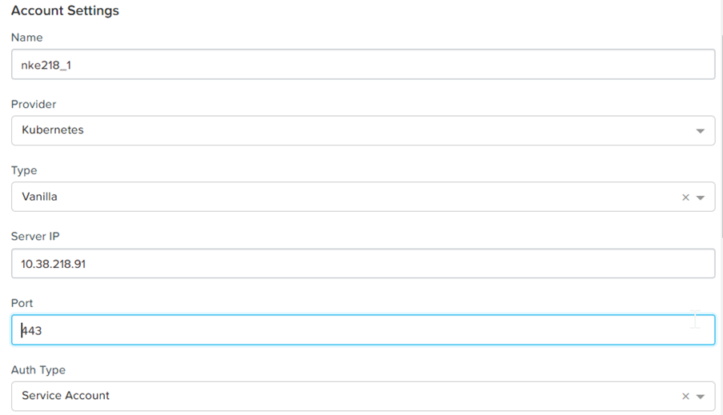
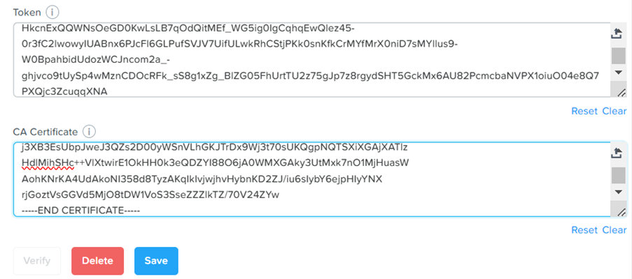
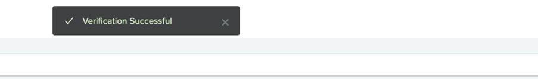

import Tabs from '@theme/Tabs';
import TabItem from '@theme/TabItem';

# Add NKE account in NCM Self Service

1.	In Calm, click on **Settings**.  Click on **Accounts**

    

2.	Click on **Add Account**

    

3.  Choose the following:
a.	Name: **Give the same name as the cluster to allow easier identification**
b.	Provider: **Kubernetes**
c.	Type: **Vanilla**
d.	Server IP: **Retrieved from the kubeconfig file**
e.	Port: **Retrieved from the kubeconfig file**
f.	Auth Type: **Service Account**

    

4.	Paste the **Token** and **CA Certificate** retrieved earlier.  Click on **Save**

    

5.	Click on **Verify**.  Ensure **Verification Successful**

    
    
