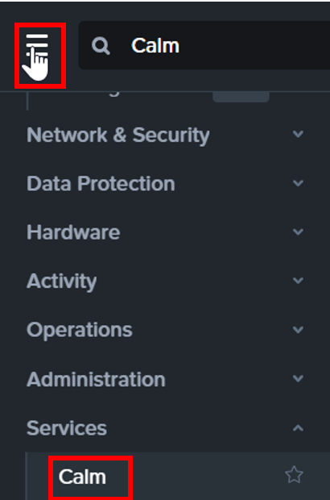
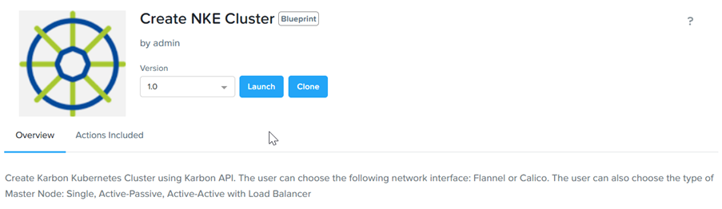

import Tabs from '@theme/Tabs';
import TabItem from '@theme/TabItem';

# Provision NKE cluster

1.	Click on highlighted item to access Calm

    

2.  Click on the **Market Place**.  Click on **Create NKE Cluster**.  Click on **Get**

    

3.  Click on **Launch**

   

4.	Select the **Environment** as assigned by your trainer

    

5.	Scroll down.  Change the cluster name according to the instruction provided by your instructor.

    

6.  Select the **Network** as assigned by your trainer.

    

7.	Scroll down

       

8.	Select the **Cluster** and **Network Adapter** as assigned by your trainer.  Click for **Deploy** 

    

9.	Navigate to **Services**. Navigate to **Kubernetes** in Prism Central.

    

10.	Observe the NKE Kubernetes is amid deployment now.

    

11. Wait for 15 to 20 mins for the application to be in **Running** state.

    

