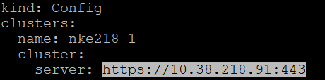
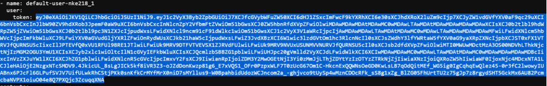
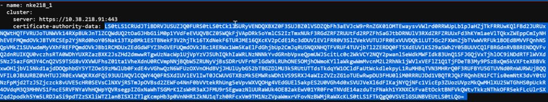
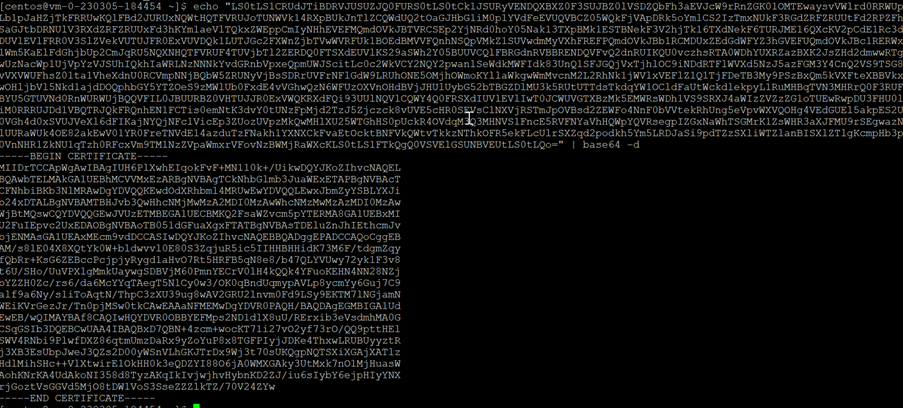

import Tabs from '@theme/Tabs';
import TabItem from '@theme/TabItem';

# Retrieve Tokens in Kubeconfig

1.	Putty to the VM.  Run the command to print out the kubeconfig

    ```bash
    cat **<cluster-name>**-kubectl.cfg

2.	Note down the IP address of the Karbon Kubernetes Cluster.

    

3.	Retrieve the contents of the token and keep a copy

    

4.  Retrieve the certificate authority data

    

5.	Run this command to convert the certificate authority data to base64 format.  Copy the contents highlighted.

    ```bash
    echo “certificate-authority-data-contents” | base64 -d

    


    

