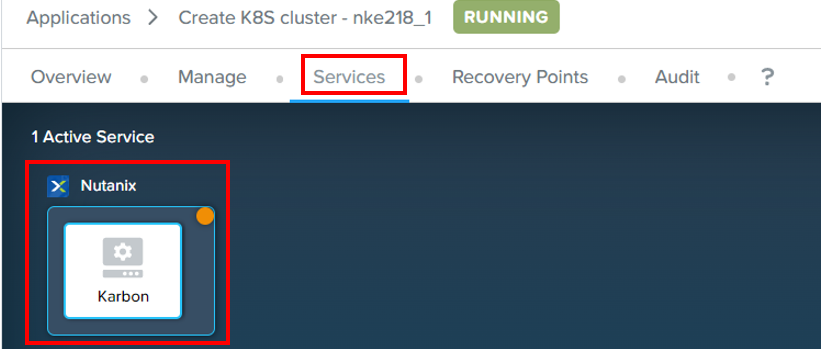
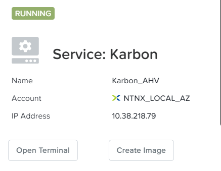
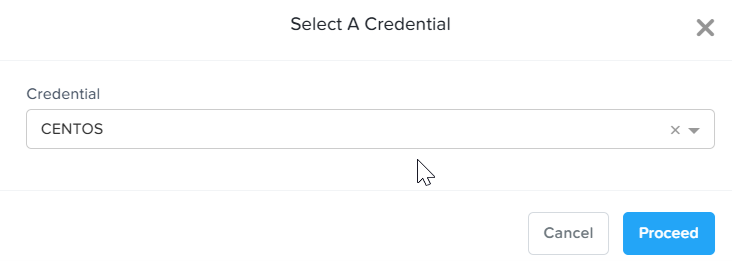
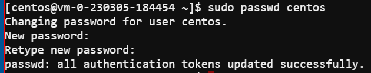
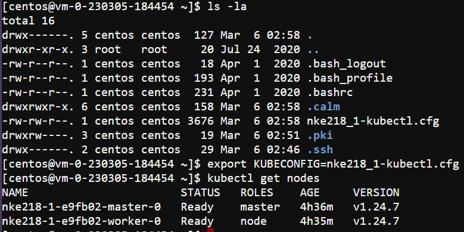

import Tabs from '@theme/Tabs';
import TabItem from '@theme/TabItem';

# Verification of Nutanix Kubernetes Engine (NKE) cluster

1.	Drill into the application.  Click on **Services**.  Click on **Karbon**

    

2.  Note down the IP address.  Click on **Open Terminal**

    

3.  Click on **Proceed**

    

4.  Run this command to change the password for centos user.  Please check with the trainer for the password

    

5.	Run these commands

    

