import Tabs from '@theme/Tabs';
import TabItem from '@theme/TabItem';

# Provision MetalLB into NKE cluster

Kubernetes does not offer an implementation of network load balancers.  MetalLB offers a network load balancer implementation that integrates with standard network equipment.  MetalLB allows external IP address to be assigned to Ingress Controller or Kubernetes services with LoadBalancer type.

# Find out available IP address for MetalLB

1.	The Calm marketplace provision both the Centos kubectl client and NKE cluster.  Click on **Services**.  Click on **Karbon**

    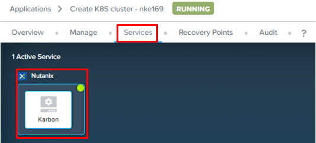

2.	On the right side of the screen, note down the IP address

    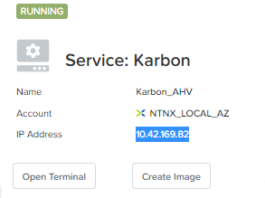

3.	Putty into the Centos VM of the NKE cluster.  Login as centos and password setup earlier.  Run this command to install nmap

    ```bash
    sudo yum -y install nmap

4.  This is the picture of running the command

    

5.  Run this command according to your cluster CIDR.  Eg cluster PHX-POC169 has a CIDR of 10.42.169.97/27.  Replace it with your assigned cluster CIDR

    ```bash
    nmap -v -sn 10.x.x.x/27

6.  This is the picture running the command

    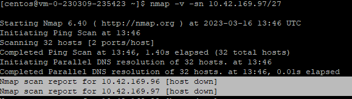

# Provision MetalLB into NKE cluster

1.	Select **Provision MetalLB on NKE cluster

    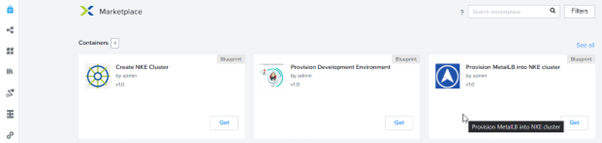

2.  Click on **Launch**

    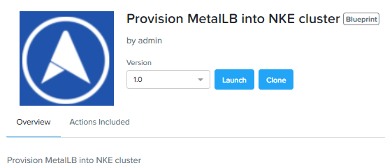

3.	Fill in the name.  Choose your **project** and **environment**.

    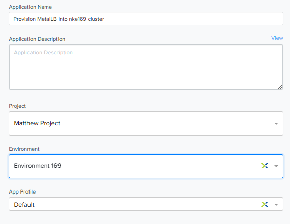

4.	Select the **NKE cluster**.  Fill in the start and end IP address reserved earlier.

    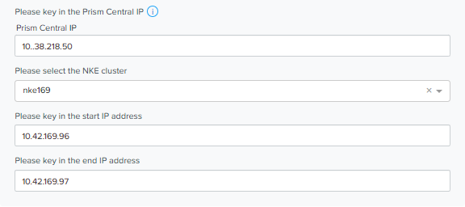

5.	The environment will auto-populate these 2 fields for the Centos VM.  Click **Deploy**

    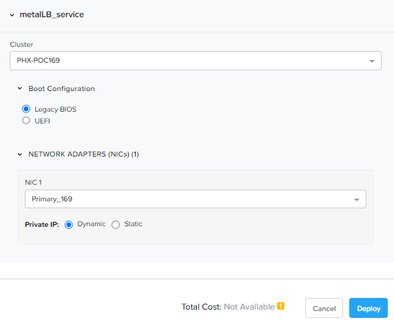

6.	Wait a few minutes for it to deploy.

    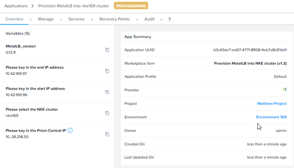

7.  Click on **Services**.  Click on **metalLB**.  

    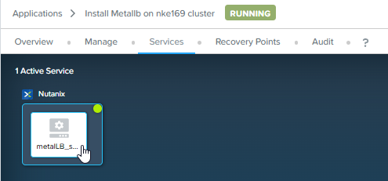

8.	On the right side of the screen, click on **Open Terminal**

    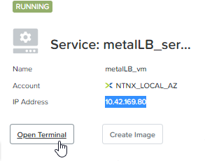

9.	Execute the following commands to connect to the NKE cluster

    ```bash
    export KUBECONFIG=xxx-kubectl.cfg
    kubectl get nodes

10.  This is the successful connection to the NKE cluster

    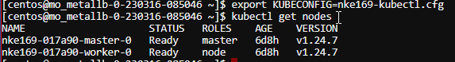

11.  Run this command to verify the metallb-system namespace was created

    ```bash
    kubectl get ns

12.  Verify the metallb-system namespace was created

    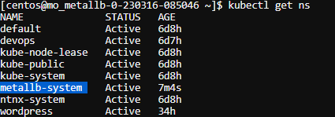

13.  Run this command to verify the pods are started and services running

    ```bash
    kubectl -n metallb-system get all

14. Verify the pods are running and services started

    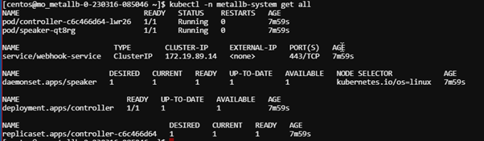


