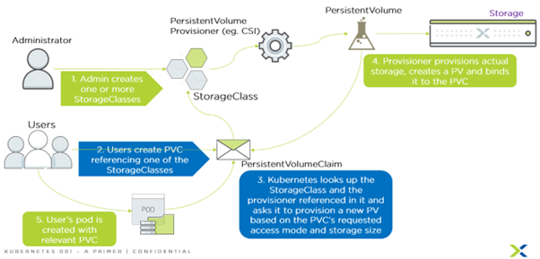
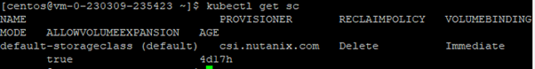

import Tabs from '@theme/Tabs';
import TabItem from '@theme/TabItem';

# CSI Driver

The Container Storage Interface (CSI) Volume Driver for Kubernetes uses Nutanix Volumes and Nutanix Files to provide scalable, persistent storage for stateful applications.
Kubernetes is an open-source platform that orchestrates the deployment, scaling, and operations of application containers across host clusters. Nutanix-hosted VMs or bare metal servers comprise a host cluster.
Kubernetes contains an in-tree CSI Volume Plug-In that allows the out-of-tree Nutanix CSI Volume Driver to gain access to containers and provide persistent-volume storage. The plug-in runs in a pod and dynamically provisions requested persistent volume (PVs) using Nutanix Files and Nutanix Volumes storage. The CSI Volume Driver supports CentOS, Red Hat Enterprise Linux (RHEL), and Ubuntu Linux distributions.
When you use Files for persistent storage, applications on multiple pods can access the same storage, and the applications also have the benefit of multi-pod read-and-write access.
Please refer to the release note on the latest CSI driver bundled.  In NKE 2.7.0, CSI Driver 2.6.1 had been installed.

# Consumption of Persistent Volumes

1.	The CSI Driver is the interface between the actual physical storage and storage class.  

2.	System Administrator defines and creates the storage class to the underlying infrastructure through the CSI Driver

3.	The developer creates the persistent volume claim (PVC).  Kubernetes looks up the storage class and request the CSI Provisioner to provision the persistent volume (PV) 

4.	The CSI Provision will provision to the underlying storage, creates the persistent volume (PV) and bind it to the persistent volume claim (PVC)

5.	The container pods are attached to the persistent volume claim

# Understand Storage Class

In NKE cluster, the Volume Storage Class had been installed during the deployment of the NKE cluster.  

# What are Persistent Volumes

Nutanix supports dynamic provisioning of PersistentVolumeClaims (PVC) using the CSI Volume Driver, which runs in a Kubernetes pod. A cluster administrator must configure a storage class for the persistent volume provisioner. The provisioner watches for a PVC request for the configured storage class and then creates a PersistentVolume (PV) for that request.

