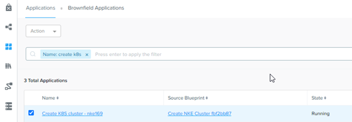
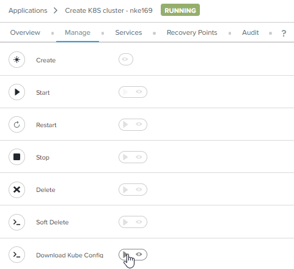
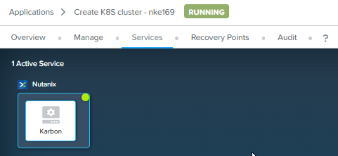
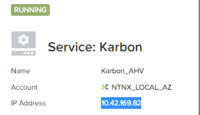
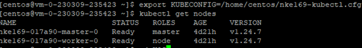

import Tabs from '@theme/Tabs';
import TabItem from '@theme/TabItem';

# Connect to the Kubernetes cluster

1.	Navigate to the Calm application of the Kubernetes cluster

    

2.	Click on **Manage**.  Click on **Download Kube Config**.  The kubeconfig file in NKE Kubernetes cluster is valid for 24 hours only.  

    

3.	Click on **Service**.  Click on **Karbon**.

    

4.	On the right side of the screen, note down the IP address.

    

5.	Putty into the Centos VM

6.	Run these commands.

    ```bash
    export KUBECONFIG=/home/centos/cluster-name-kubectl.cfg
    kubectl get nodes

7.	This is the output of these commands.

    

