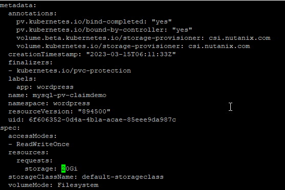
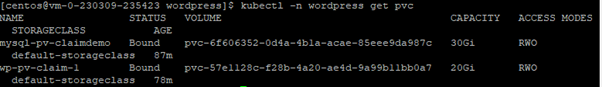
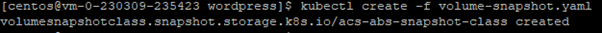
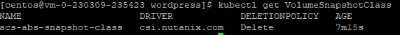
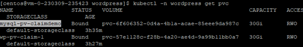
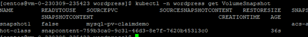

import Tabs from '@theme/Tabs';
import TabItem from '@theme/TabItem';

# Expand the size of the Persistent Volume Claim

When your stateful application is running out of storage space, you can modify the PersistentVolumeClaim to the desired size without stopping the application. The csi-resizer sidecar container watches PVCs for any volume resize request. When the PVC is resized, the csi-resizer interacts with the CSI driver to expand the underlying volume to the desired size. After the volume is resized, kubelet requests the CSI driver running on the worker node where the application is running to expand the volume and its file-system. The volume is expanded while your application continues to run.

1.	Run this command to expand the persistent volume.

    ```bash
    kubectl -n wordpress edit pvc mysql-pv-claimdemo

2.	Change from 20 Gi to 30 Gi.  Key in wq to save the change

    

3.  Wait around 15 to 30 seconds.  Run this command and observe the pvc volume had been expanded.

    

# Volume Snapshot

Use snapshots of persistent volume claims (PVCs) to create new PVCs and persistent volumes (PVs) with Nutanix Volumes only. CSI driver supports taking volume snapshots and restoring the volume. CSI driver creates a storage efficient snapshot in a second using the volumes snapshot capability. You can also create a backup of your application in Nutanix Objects, AWS S3, or any S3 compatible storage.
Taking a snapshot of a PVC lets you reuse the data in that snapshot to create a new PVC and PV in the future. The snapshot only stores data from the time you take the snapshot. The newly created snapshot appears as a VolumeSnapshot in the same Kubernetes cluster as the original PVC.

1.	Run this command to create a secret: ntnx-secret in kube-system namespace.  Retrieve the password of the prism element cluster from your trainer.

    ```bash
    kubectl -n kube-system create secret generic ntnx-secret --from-literal=password=’xxxxx’

2.	Create the volume-snapshot.yaml file as shown below:

    ```bash
    echo "
    apiVersion: snapshot.storage.k8s.io/v1
    kind: VolumeSnapshotClass
    metadata:
    name: acs-abs-snapshot-class
    driver: csi.nutanix.com
    parameters:
    storageType: NutanixVolumes
    csi.storage.k8s.io/snapshotter-secret-name: ntnx-secret
    csi.storage.k8s.io/snapshotter-secret-namespace: kube-system
    deletionPolicy: Delete" | tee volume-snapshot.yaml

3.	Run this command to create the storage class.

    ```bash
    kubectl create -f volume-snapshot.yaml

4.  This is an example of the output

    

5.	Run this command to verify the existence of the VolumeSnapshotClass

    ```bash
    kubectl get VolumeSnapshotClass

6.  This picture shows the existence of the VolumeSnapshotClass

    

# Take a VolumeSnapshot

This section explains how to take a volume snapshot of an existing persistent volume claim (PVC).  The purpose of the volume snapshot is to backup existing contents of a stateful pod.  In this case, we are backup the data in the MySQL pod

1.	Run this command to get an existing PVC.

    ```bash
    kubectl -n wordpress get pvc

2.  This picture shows the existing PVC

    

2.	Run this command to create a take-volume-snapshot.yaml file for mysql-pv-claimdemo

    ```bash
    echo "
    apiVersion: snapshot.storage.k8s.io/v1
    kind: VolumeSnapshot
    metadata:
    name: snapshot1
    spec:
    volumeSnapshotClassName: acs-abs-snapshot-class
    source:
        persistentVolumeClaimName: mysql-pv-claimdemo" | tee take-volume-snapshot.yaml

3.	Run this command to apply the change

    ```bash
    kubectl -n wordpress apply -f take-volume-snapshot.yaml

4.	Run this command to verify the successful creation of the VolumeSnapshot

    ```bash
    kubectl -n wordpress get VolumeSnapshot

5.  Observe the creation of the VolumeSnapshot

    


