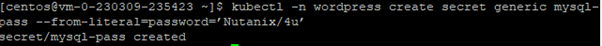
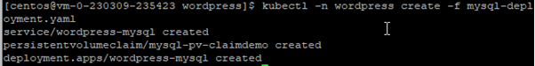
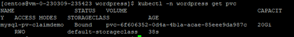
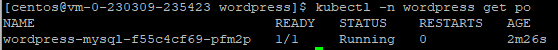
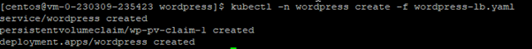
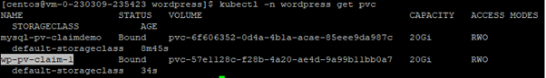
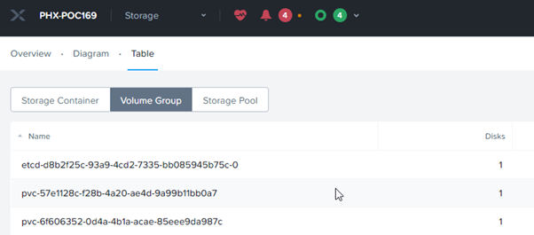
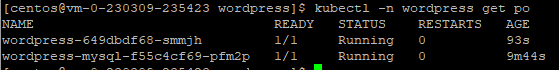

import Tabs from '@theme/Tabs';
import TabItem from '@theme/TabItem';

# Persistent Volume with Nutanix Volume

Nutanix distributed storage delivers storage using multiple protocols, including Network File System (NFS), Server Message Block (SMB), and Internet Small Computer System Interface (iSCSI). Nutanix Volumes is enterprise-class, software-defined storage that exposes storage resources directly to virtualized guest operating systems or physical hosts using the iSCSI protocol.

Nutanix CSI driver provides ReadWriteOnce PV using Volumes. You must first configure a storage container in an AOS cluster with the required storage properties such as deduplication, compression, erasure coding, and thin provisioning.  Nutanix Volumes exposes the provisioned volumes as iSCSI targets

# Deploy a stateful application with Nutanix Volume

1.	This application comprises of 2 pods: Wordpress & MySQL

2.	Create namespace

    ```bash
    kubectl create ns wordpress

3.	Create secret in the default namespace

    ```bash
    kubectl -n wordpress create secret generic mysql-pass --from-literal=password=’Nutanix/4u’

4.	This is the output of running the command

    

5.	Run this command to download the manifests

    ```bash
    git clone https://github.com/mat0606/K8S

6.  Navigate to the following directory

    ```bash
    cd K8S/wordpress

7.  Run this command to view the mysql-deployment.yaml.  Observe the services, persistent volume claim and deployment specification.

    ```bash
    cat mysql-deployment.yaml

8.  Run this command to create the mysql pod.

    ```bash
    kubectl -n wordpress create -f mysql-deployment.yaml

9.  This is the output

    

10.	Run this command to verify the successful creation of the persistent volume claim (PVC) and binding of persistent volume (PV)

    

11.	Run this command to verify the successful creation of mysql pods

    ```bash
    kubectl -n wordpress get po 

12.  Observe the status of the mysql pods to be in **Running** state

    

13. Run this command to observe the service, persistent volume claim and deployment of wordpress.
    
    ```bash
    cat wordpress-lb.yaml

14. Run this command to create the wordpress pods

    ```bash
    kubectl -n wordpress create -f wordpress-lb.yaml

15.	This is an example of the output

    

16.  Run this command to verify the persistent volume claim (PVC)

    

17.	Login to Prism Element cluster.  Retrieve the admin **password** from the trainer.  

18.  This NKE cluster is created on PHX-POC169 cluster. Click on **Storage**.  Click on **Table**.  Click on **Volume Group**.  Observe the pvc matches the output of the kubectl listing of pvc

    

19.  Run this command to verify the wordpress pods are started out successfully

    

20.  An ingress controller must be installed to route the traffic to the wordpress application.


