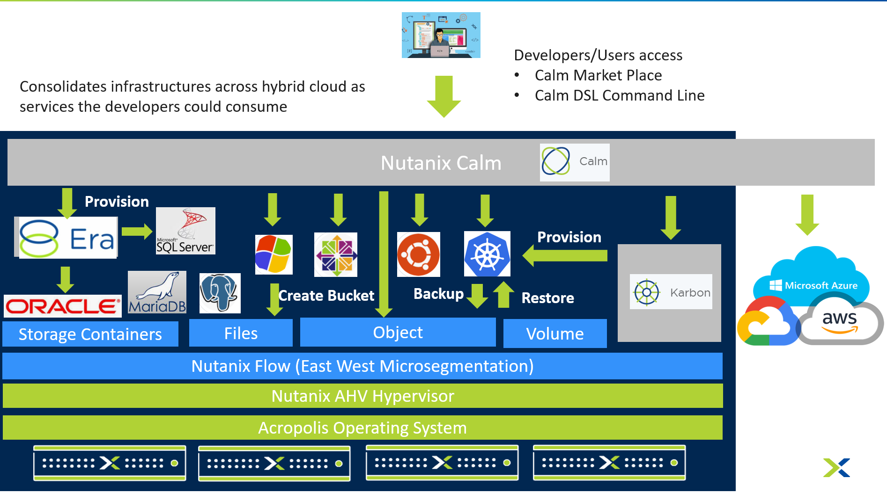
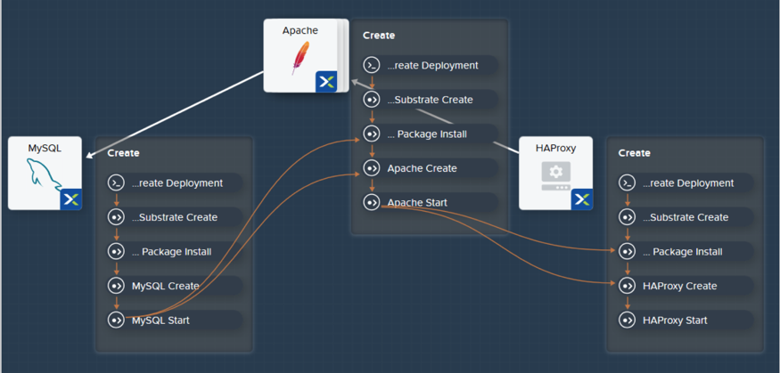
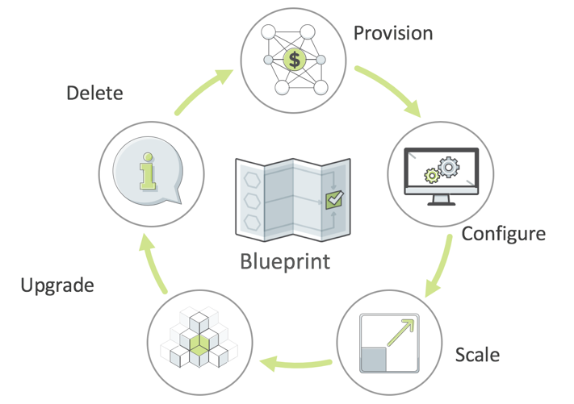
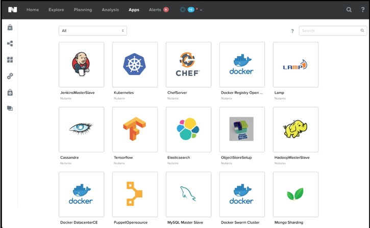
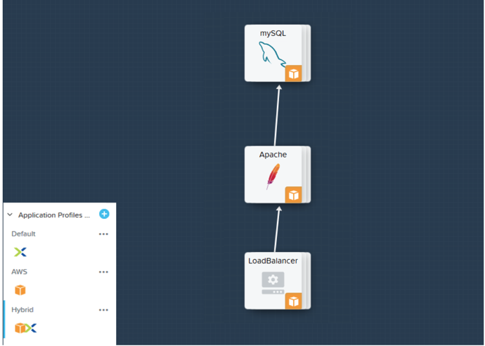

# Overview

NCM Self Service (Formerly Calm) provides advanced application-level orchestration that transforms
how IT teams manage applications and support the business. Fully
integrated into the Nutanix platform, Calm delivers a powerful, common
management framework that can be simultaneously leveraged by multiple IT
teams to rapidly create and deliver applications.

NCM Self Service allows IT to expose the underlying infrastructure across multiple
clouds as services the development and the business team can consume
easily.

# NCM Self Service: Application Lifecycle Automation

## Blueprints Capture All Elements of the Application

## Make Sense of Complexity in a Visual Way

-   Capture organizational knowledge
-   Streamline provisioning and lifecycle tasks
-   Easy to understand dependencies

## Blueprints Are Flexible and Open

-   Utilize existing Bash or Powershell scripts
-   Call any external service using REST API

## Blueprints Are Used for Lifecycle Management

-   Automate **routine** application management operations
-   Reduce errors,delays and downtime

# NCM Self Service: Self-Service and Governance

## Nutanix Marketplace Empowers Self-Service

-   One-Click App Provisioning
-   Pre-integrated blueprints
-   Self-service based onuser role and group

## Deploy in One-Click

## End-to-End Audits and Governance

# NCM Self Service: Hybrid Cloud Management

## Hybrid Cloud Management

## Deploy across Clouds Based on Need

-   Cloud destination is configured once, then used with any blueprint

## Automate. Empower. Relax

## Takeaways

NCM Self Service Native Capabilities:

-   **Application Lifecycle Management:** Fully automate the provisioning, scaling, and deletion of both traditional multi-tiered
    applications and modern distributed services using pre-integrated blueprints that make management of applications in private and
    public clouds extremely simple.
-   **Customizable Blueprints:** Simplify the set-up and management of custom enterprise applications by incorporating all elements of each
    app, including relevant VMs, configurations and related binaries, into an easy-to-use-blueprint that is managed by the infrastructure
    team. IT teams can eliminate the hours and days currently devoted to routine application management.
-   **Nutanix Marketplace:** Blueprints can be published directly to end users through the Nutanix Marketplace, giving application owners and
    developers the ability to request IT services that can then be instantly provisioned.
-   **Governance:** Calm maintains control with role-based governance that limits user operations based on permissions. Additionally, all
    activities and changes are centrally logged for end-to-end traceability, aiding security teams with key compliance initiatives.
-   **Hybrid Cloud Management:** Automate the provisioning of Hybrid Cloud architectures, scaling both multi-tiered and distributed
    applications across different cloud environments, including AWS. Calm shows the overall utilization and true cost of your public
    cloud consumption at a glance so that decisions are based on business needs and budget requirements.
